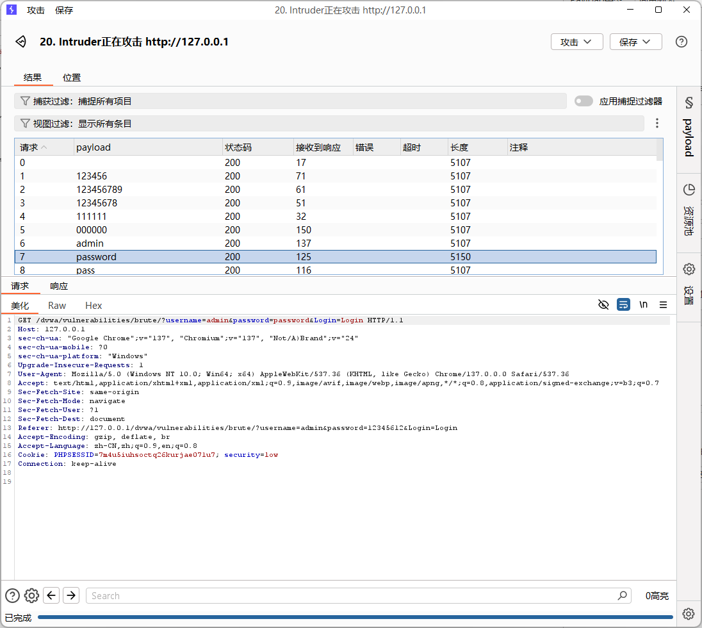
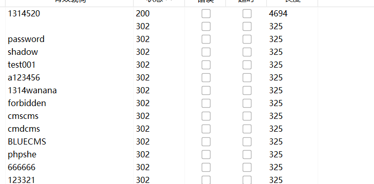
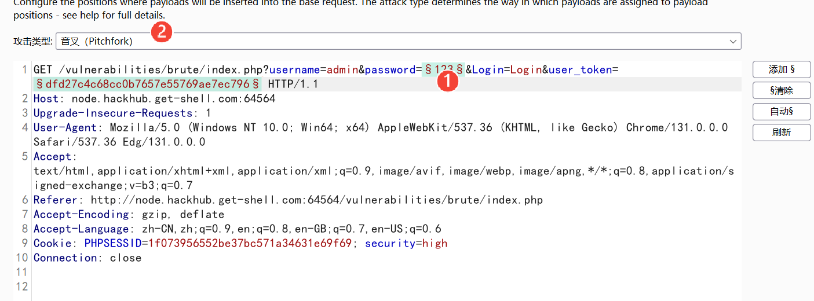
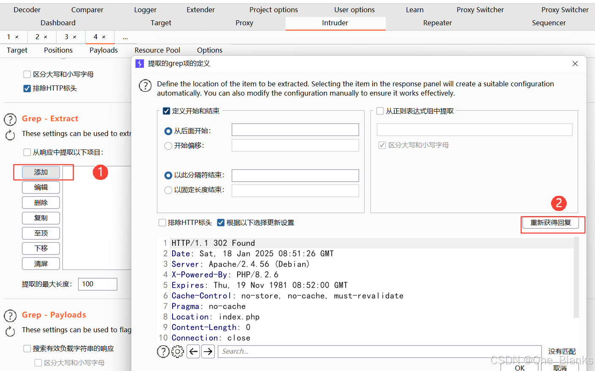
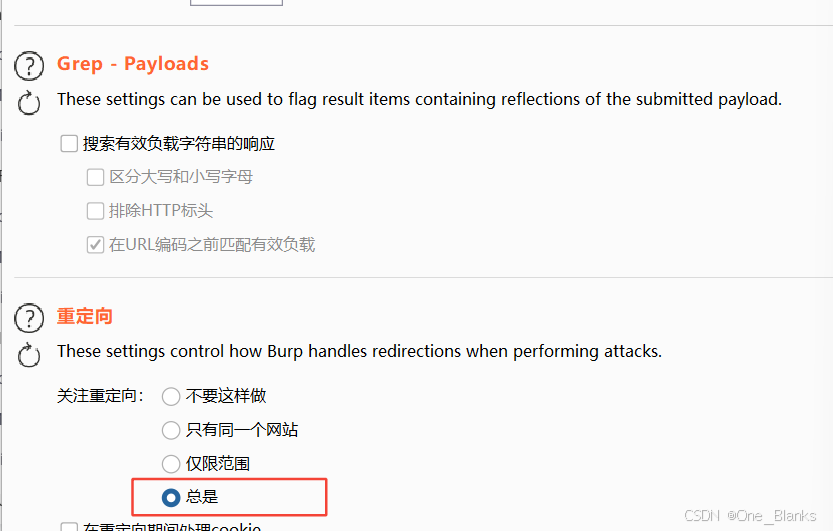
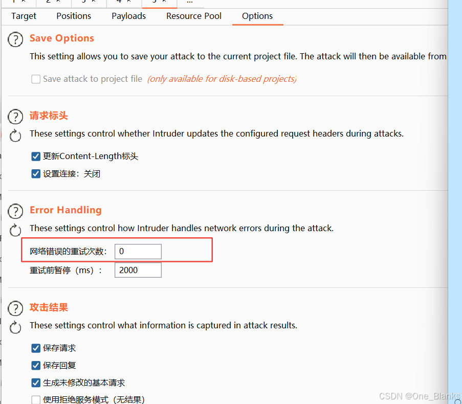
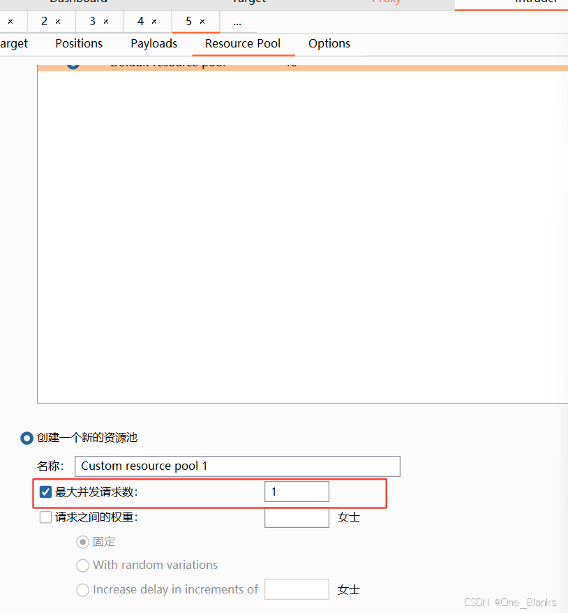
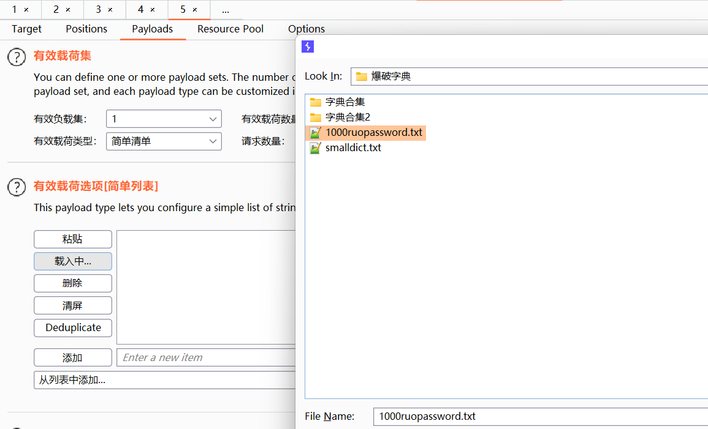
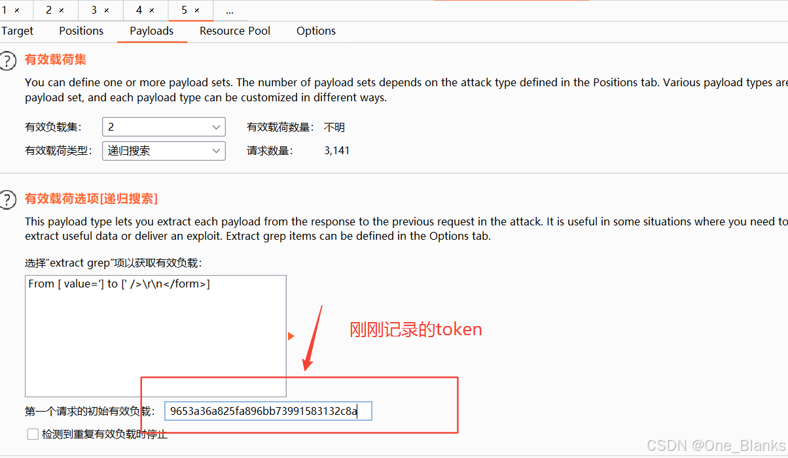
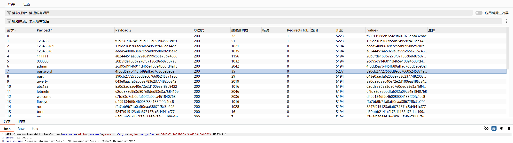

# Brute Force模块

### 推荐工具
| 工具 | 用途 |
|---|---|
| 浏览器开发者工具 | 查看请求参数 |
| Burp Suite | 抓包、重放、Intruder 爆破 |
| Hydra | 命令行暴力破解 |
| wfuzz / ffuf | Web 参数 fuzz |
| Python requests | 编写自动化脚本 |
| rockyou.txt | 常用密码字典 |

## Low等级实操:无任何防护

## 使用burp suite Intruder爆破
>第一步:配置代理
1. 浏览器代理设置为127.0.0.1:8080
2. burp suite打开: Proxy ->Intercept
>第二步:抓取登录请求
1. 在页面输入任意用户名和密码，例如admin/123456点击login
2. burp捕获请求后，右键选择:send to Intruder
>第三步:设置爆破位置
1. 进入Intruder > Position
2. 请求类似GET /dvwa/vulnerabilities/brute/?username=admin&password=123456&Login=Login HTTP/1.1
3. 将密码参数标记为payload.password=§123456§
4. 如果想同时爆破用户名和密码，可以设置username=§admin§&password=§123456§
>第四步:设置payload
1. 进入,Intruder > payloads
2. 如果只爆破密码,选择 Payload type:Simple list
>第五步:开始攻击
1. 点击: start attack，观察相应长度，状态码，返回内容
2. 失败响应中可能包含: Username and/or password incorrect.
3. 成功响应中可能包含: Welcome to the password protected area admin
效果图
## 使用Hydra爆破
low等级GET请求可以使用
```javascript
hydra -l admin -P passwords.txt 127.0.0.1 http-get-form "/dvwa/vulnerabilities/brute/:username=^USER^&password=^PASS^&Login=Login:Username and/or password incorrect.:H=Cookie: PHPSESSID=你的session值; security=low"
```
### 参数说明
1. 指定用户名为admin，-l admin
2. 指定密码字典，-P passwords.txt
3. 目标是HTTP GET表单，http-get-form
4. Hydra中用户名变量:^USER^
5. Hydra中密码变量^PASS^
6. 失败条件判断Username and/or password incorrect.
7. 添加请求头cookie:H=Cookie
8. 你需要替换PHPSESSID=你的session值，可从浏览器开发者工具或者Burp suite中获取


## Low等级源码分析
```javascripte
$user = $_GET['username'];
$pass = $_GET['password'];
$pass = md5($pass);
$query = "SELECT * FROM users WHERE user = '$user' AND password = '$pass';";
```
### 存在的问题
1. 没有失败次数限制
2. 没有验证码
3. 没有登录延迟
4. 没有 Token
5. 使用 GET 传递密码
6. 响应信息容易区分成功和失败
7. 可能存在 SQL 注入风险

# Medium等级特点:输入任意用户名和密码登录会有一定的延迟
1. 登录失败后会有延迟，例如 sleep(2)
2. 仍然没有验证码
3. 仍然没有账户锁定
4. 仍然可以暴力破解
5. 可能对输入做了一定过滤

### 手工测试
1. 设置DVWA Secuity为Medium
2. 输入错误密码:admin/123456
>你会发现每次失败响应会变慢

### Brute Suite爆破
抓包后请求仍然类似:
```html
GET /dvwa/vulnerabilities/brute/?username=admin&password=123456&Login=Login HTTP/1.1
Host: 127.0.0.1
Cookie: PHPSESSID=xxxx; security=medium
```
1. 设置payload：
password=§123456§
2. 启动Intruder,由于服务器加入延迟,爆破速度明显降低。

### Hydra爆破Medium
**命令与low类似，只需要修改cookie中的安全等级**

```javascript
hydra -l admin -P passwords.txt 127.0.0.1 http-get-form "/dvwa/vulnerabilities/brute/:username=^USER^&password=^PASS^&Login=Login:Username and/or password incorrect.:H=Cookie: PHPSESSID=你的session值; security=medium"
```

## 源码分析
```html
if( $total == 1 ) {
    echo "Welcome";
} else {
    sleep(2);
    echo "Username and/or password incorrect.";
}
```
>其核心防护是:sleep(2);,也就是失败后延迟2秒
### Medium等级防护效果
>这种方式可以降低爆破速度，但不是根本防御,假设密码字典有1000条，1000x2秒=2000秒，大约33分钟

**但攻击者仍然可以**
1. 多线程
2. 分布式请求
3. 使用更小的高质量字典
4. 对常见账号进行喷洒攻击

# High等级实操
## 等级特点
1. CSRF Token
2. 每次请求token不同
3. Token校验失败会导致请求无效
4. 简单工具直接爆破会失败
5. 请求中会带上user_took=xxxx

```html
抓包后可能看到GET /dvwa/vulnerabilities/brute/?username=admin&password=123456&Login=Login&user_token=abc123 HTTP/1.1
Host: 127.0.0.1
Cookie: PHPSESSID=xxxx; security=high
```
**关键点是user_token=abc123,该token每次请求后可能都会变化**

## 为什么普通爆破会失败？
```html
username=admin
password=123456
user_token=固定值
```
>如果你直接用固定请求爆破,第一次有效，后续请求token失效，服务器会认为请求非法，这会导致
1. 请求失败
2. 爆破结果不准确
3. 工具无法正确判断密码
## high难度实操
1. 可以看到就一个200响应码，其他都是302

2. 这个等级下就给登录上了一个token了，每一次登录token就会变一次，所以我们需要用burp配置一个宏，去让它自动获取这个token以此支持我们的爆破,将这两个设为变量，并且设为草叉pitchfock模式

3. 在Options里添加宏，并且获取回复拿到响应包，这里我们需要一个没有消耗点token的请求包，就是拦截后直接发给爆破模块去设置宏

4. 搜索token，然后用鼠标将引号中的值划出，上面的参数burp会自动进行补全，并且将这个token值记录下来：9653a36a825fa896bb73991583132c8a,弄好以后点击OK

5. 重定向设置一下，这样最后登录就都是200

6. 网络错误重试给他设为0，token都是一次就无的肯定不能让它去重连的

7. 并发设为1不能让它并发爆破，需要token进行逐个验证使用

8. 第一个变量：字典加载

9. 第二个变量使用递归搜索（grep）

10. 然后开始攻击，就会有如下显示


### 完整逻辑1. 抓取 High 难度登录请求
2. Send to Intruder
3. Intruder 中只标记 password 为 payload
4. 创建 Macro，访问 /dvwa/vulnerabilities/brute/
5. 从响应中提取 user_token
6. 创建 Session Handling Rule
7. 让 Intruder 每次请求前运行 Macro
8. 用新 token 替换当前请求中的 user_token
9. Start attack
10. 根据 Length 或成功关键词判断密码


**一句话总结：DVWA High 爆破的关键不是密码字典，而是让 Burp 每次请求前自动获取并替换新的 user_token。**

# Impossible 
## 防护逻辑
1. 失败次数限制：连续失败三次后锁定账户15分钟
2. CSRF TOKEN 防止跨站请求伪造和简单重放
3. 参数化查询：防止SQL注入
4. 同意错误提示，避免攻击者判断是用户名错误还是密码错误
5. 安全密码存储：使用更安全的哈希算法，而不是简单 MD5。

### 源码分析
```html
$stmt = $db->prepare('SELECT failed_login, last_login FROM users WHERE user = ?');
$stmt->bind_param('s', $user);
$stmt->execute();
```
>说明使用了参数化查询

# 各等级对比
| 安全等级 | 防护措施 | 是否容易爆破 | 学习重点 |
|---|---|---|---|
| Low | 无防护 | 非常容易 | 基础暴力破解、GET 参数分析 |
| Medium | 登录失败延迟 | 仍可爆破 | 延迟机制、爆破成本 |
| High | CSRF Token | 需要脚本处理 | Token 获取与自动化 |
| Impossible | 锁定、Token、参数化查询等 | 较难 | 综合防御设计 |


