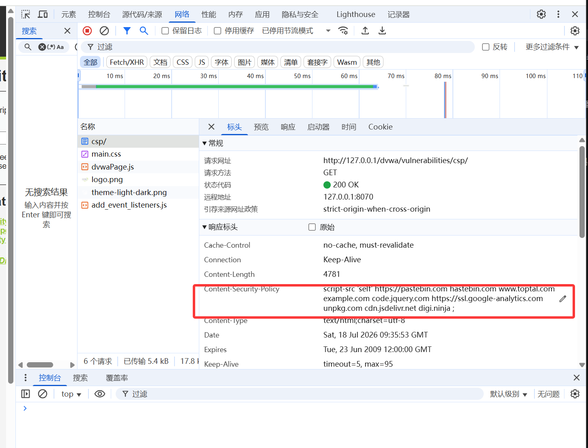
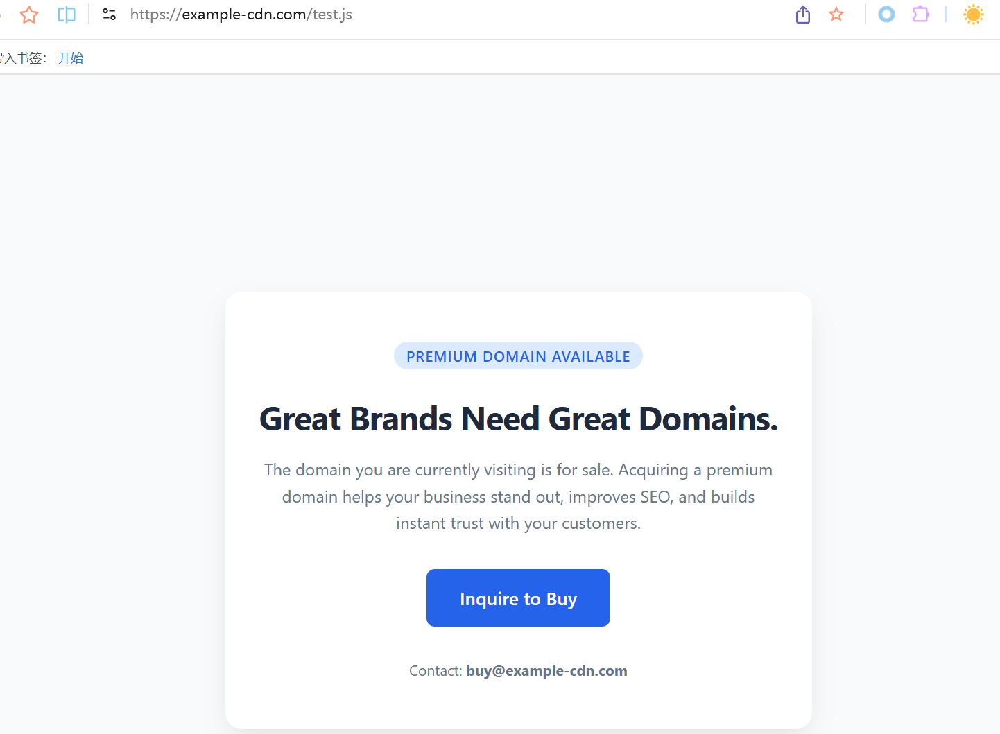
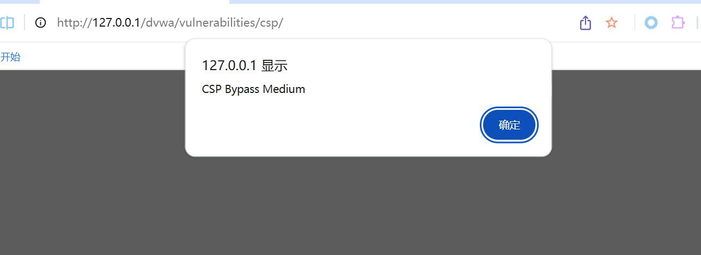
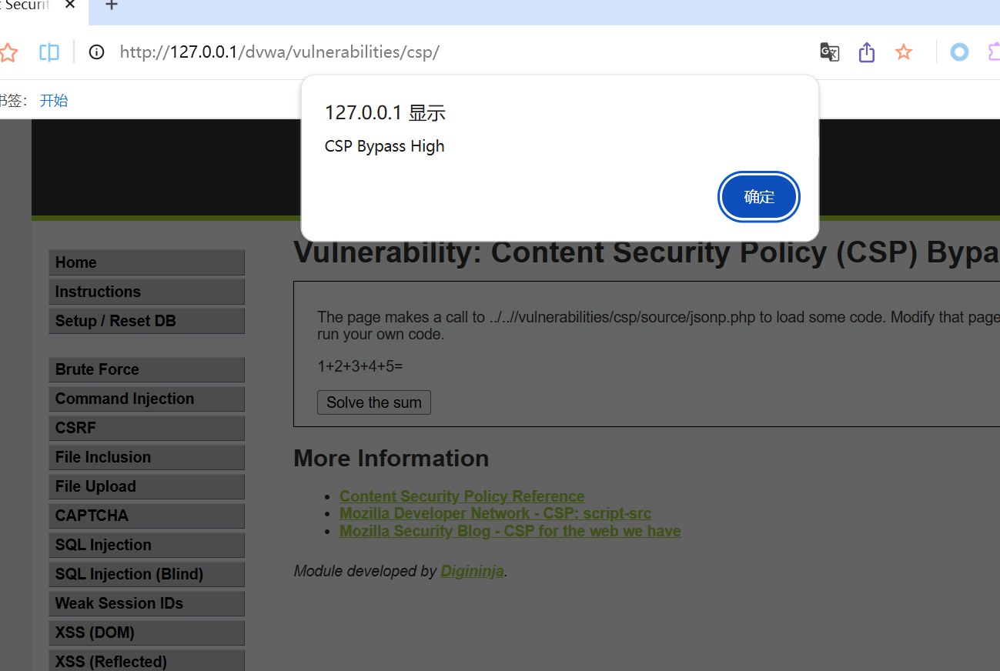

# CSP Bypass内容安全政策绕过
# CSP基础知识
详细信息:https://digininja-dvwa.mintlify.app/vulnerabilities/csp-bypass
>CSP 是浏览器的一种安全机制，用来限制页面可以从哪里加载或执行脚本、样式、图片等资源
常见CSP指令
>Content-Security-Policy: script-src 'self'
含义：只允许执行当前站点同源的javascript,常见配置项
| 配置 | 含义 | 风险 |
|---|---|---|
| `script-src 'self'` | 只允许加载本站脚本 | 相对安全，但如果本站有 JSONP、上传、可控 JS，仍可能被绕过 |
| `script-src 'unsafe-inline'` | 允许内联脚本 | 高风险，会削弱 CSP 防 XSS 能力 |
| `script-src https://example.com` | 允许指定外部域脚本 | 如果白名单域可被攻击者利用，就有风险 |
| `nonce-xxx` | 允许带有对应 nonce 的脚本执行 | nonce 必须每次请求随机生成，不能固定 |
| `strict-dynamic` | 信任由合法脚本动态加载的脚本 | 现代 CSP 推荐方案之一 |
# Low等级实操
## low等级核心问题
```html
Low 等级使用了一个 过于宽松的 CSP 白名单，允许从多个外部域名加载脚本。12

也就是说，页面虽然启用了 CSP，但它允许你从某些第三方域加载 JavaScript。只要攻击者能把恶意 JS 放到这些被允许的域名上，就能执行代码。
```
对应漏洞点：
>白名单过大，允许多个第三方脚本源，导致攻击者有机会从允许的域名加载恶意脚本。
## 查看CSP响应头
1. 进入DVWA -> CSP Bypass
2. 打开浏览器开发者工具：F12 -> Network -> 刷新页面 -> 点击当前请求 -> Headers
3. 查找：Content-Security-Policy
4. 你会看到类似：Content-Security-Policy: script-src 'self' https://某些被允许的域名 ...
5. 不同 DVWA 版本中白名单可能略有区别。重点是观察 script-src 中允许了哪些外部域。


## 构造外部JS
创建一个JS文件，例如：
>alert('CSP Bypass Low');
如果允许的白名单域支持你上传或者托管JS,你可以把这个JS文件放到白名单允许的域下，例如，假设CSP允许：
>script-src 'self' https://example-cdn.com
那么你需要构造
```HTML
<script src="https://example-cdn.com/your-alert.js"></script>
```
或者页面表单如果只要求输入URL，则直接输入：
>https://example-cdn.com/your-alert.js

## low攻击流程
1. 切换安全等级为 Low。
2. 进入 CSP Bypass 页面。
3. 查看 CSP，确认允许的外部脚本域。
4. 将你的恶意 JS 放到允许的域名下。
5. 在输入框中提交该 JS 地址。
6. 如果成功，浏览器会执行你的脚本，弹出：
>alert('CSP Bypass Low');


# LOW 等级学习点
1. CSP 白名单不是越多越好。
2. 如果允许了第三方 CDN、Paste 服务、用户可上传内容的站点，攻击者可能滥用这些站点托管恶意 JS。
3. script-src 的安全性取决于白名单源是否可信。
4. CSP 不是“写了就安全”，配置错误一样会被绕过。
5. 不应白名单允许能托管任意用户内容的域名，例如部分 CDN、代码托管、Paste 服务等。1

# Medium等级实操
## 核心问题
**edium 等级尝试使用 nonce 防止内联脚本执行，但是实现有严重错误：**
```html
nonce 是固定值，不会变化。
CSP 同时允许了 'unsafe-inline'。
用户输入直接输出到页面中。
```
参考中给出的medium CSP典型形式如下：
>Content-Security-Policy: script-src 'self' 'unsafe-inline' 'nonce-TmV2ZXIgZ29pbmcgdG8gZ2l2ZSB5b3UgdXA=';
其中nonce是TmV2ZXIgZ29pbmcgdG8gZ2l2ZSB5b3UgdXA=
**该值是固定不变的**
## nonce是什么
正常情况下，服务端应该为每次响应生成一个随机nonce:
>Content-Security-Policy: script-src 'nonce-randomValue123'
页面中只有带有相同Nonce的脚本才能执行
```HTML
<script nonce="randomValue123">
    alert(1);
</script>

```
>但是如果 nonce 是固定的，那么攻击者看一次页面就知道 nonce，以后可以直接复用。

>nonce 必须是加密安全的随机值，并且每个请求都唯一，否则没有安全意义

## 实操Payload
1. 进入该等级页面
2. 输入以下内容：
```html
<script nonce="TmV2ZXIgZ29pbmcgdG8gZ2l2ZSB5b3UgdXA=">alert("CSP Bypass Medium");</script>
```
提交后，如果页面直接将用户输入渲染到html中，并且nonce与CSP中的 nonce 匹配，就会执行弹窗。这个思路在公开实验笔记中也有类似示例：给 <script> 标签添加正确的 nonce 后即可执行脚本。


# Medium等级学习点

1. nonce 不能写死。
2. nonce 必须每个请求动态生成。
3. 同时使用 nonce 和 'unsafe-inline' 是错误配置。
4. CSP 不能替代表单输入过滤和输出编码。
5. 用户输入直接进入 HTML 页面仍然可能导致 XSS。
6. CSP 是纵深防御，不是唯一防线。

# High等级实操
## 核心问题
High等级使用了更严格的CSP，通常只允许script-src 'self'
```HTML
这意味着页面只能加载同源脚本。

表面上看，攻击者不能加载外部恶意 JS，也不能执行内联脚本。

但是 High 等级存在另一个问题：页面使用了 JSONP，并且 JSONP 的 callback 参数可控。
```
## JSONP是什么
>JSONP 是一种老式跨域数据加载方式，它本质上是通过 <script src=""> 加载一段 JavaScript。
```例如
<script src="/api/jsonp.php?callback=solveSum"></script>
```
服务端返回：
>solveSum({"answer": 15});
浏览器会把返回内容当做javascript执行，如果callback参数可控，例如：
>callback=alert(1)//
服务端可能返回
>alert(1)//({"answer": 15});
这样就执行了攻击者控制的JS
## 查看High页面逻辑
High 等级页面中通常有一个类似“计算 1+2+3+4+5”的功能。
点击按钮时，页面创建一个 <script> 标签：
```html
function clickButton() {
    var s = document.createElement("script");
    s.src = "source/jsonp.php?callback=solveSum";
    document.body.appendChild(s);
}
```
也就是说，它请求了：
>source/jsonp.php?callback=solveSum
相关公开资料也提到 High 等级通过 jsonp.php?callback=solveSum 进行 JSONP 调用，并且可以修改 callback 参数触发代码执行。
例如https://braincoke.fr/write-up/dvwa/dvwa-csp-bypass/

## 使用Burp suite拦截修改
1. 切换安全等级为 High。
2. 进入 CSP Bypass 页面。
3. 打开 Burp Suite。
4. 浏览器代理设置到 Burp。
5. 点击页面中的 Solve the sum 按钮。
6. Burp 拦截请求：
>GET /DVWA/vulnerabilities/csp/source/jsonp.php?callback=solveSum HTTP/1.1
Host: 127.0.0.1
7. 修改call back参数为：
>alert("CSP Bypass High")//
完整请求变成
```html
GET /DVWA/vulnerabilities/csp/source/jsonp.php?callback=alert("CSP Bypass High")// HTTP/1.1
Host: 127.0.0.1
```
如果URL编码后，可以写成
>callback=alert%28%22CSP%20Bypass%20High%22%29%2F%2F
8. 放行请求
9. 页面弹窗
>alert("CSP Bypass High")


## 为什么High等级能够绕过script-src 'self'
1. 因为恶意代码并不是从外部域加载的，而是通过本站的：
>source/jsonp.php
返回的,CSP看到的
```html
es/csp/source/jsonp.php?..."></script>
```
这是通源资源，符合：
>script-src 'self'
所以浏览器允许执行，但是 JSONP 返回内容被攻击者通过 callback 参数污染了，于是导致 JavaScript 执行。

# High 等级学习点
**你可以学到：**

1. script-src 'self' 不是绝对安全。
2. 如果同源下存在可控 JavaScript 输出点，例如 JSONP、上传 JS、可控 MIME、3. 开放重定向配合某些场景，CSP 仍可能被绕过。
3. JSONP 本质是执行 JavaScript，不是纯数据接口。
4. JSONP 的 callback 参数不能由用户任意控制。
5. 现代应用应尽量使用 CORS + JSON，避免 JSONP。
6. 同源资源也需要被审计，不能只关注外部脚本。

# Impossible 等级防护机制
1. 使用严格 CSP，只允许同源脚本。
2. 没有动态可控 callback。
3. JSONP 回调函数名被硬编码，用户不能控制。
4. 不允许用户输入直接作为 HTML 或 JavaScript 渲染。
5. 禁止内联脚本。
公开资料中也提到 Impossible 等级通过硬编码 JSONP callback、严格 CSP、不渲染用户输入为 HTML/JS 等方式有效缓解了绕过。
https://deepwiki.com/digininja/DVWA/10-content-security-policy-(csp)

# 学习知识点
1. 正确 CSP 配置可以显著降低 XSS 风险。
2. CSP 应禁止不必要的内联脚本。
3. 不要使用固定 nonce。
4. 不要允许用户控制 JSONP callback。
5. 最好避免 JSONP。
6. 所有用户输入都应进行输出编码。
7. CSP 是防御层之一，必须配合安全编码。

# 四个等级总结表
| 等级 | CSP/实现特点 | 漏洞原因 | 绕过方式 |
|---|---|---|---|
| Low | 允许多个外部脚本源 | 白名单过于宽松 | 从允许的第三方域加载恶意 JS |
| Medium | 固定 nonce + `unsafe-inline` | nonce 可预测，且允许内联脚本 | 使用固定 nonce 构造 `<script>` |
| High | `script-src 'self'` | 同源 JSONP callback 可控 | 修改 `callback=alert(1)//` |
| Impossible | 严格 CSP + callback 硬编码 | 无明显绕过点 | 理论上无法绕过 |