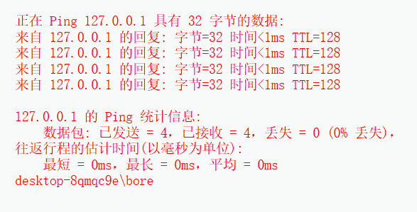

# Command Injection命令注入
# 直接下载使用的靶场，使用时可能会出现乱码，可联系我帮忙解决3459786507@qq.com
>DVWA 的 Command Injection 模块模拟的是 操作系统命令注入漏洞
1. 该模块通常提供一个输入框，让用户输入一个IP地址，然后后台执行类似命令:
```javascripte
ping -c 4 用户输入
```
2. 如果后端没有正确过滤用户输入，攻击者就可以通过命令连接符拼接额外系统命令，例如：
```javascript
127.0.0.1 ;whoami
```
3. 最终后台执行的命令可能变成:
```html
ping -c 4 127.0.0.1;whoami
```
效果图:
**这样不仅执行了ping,还执行了whoami**

# 基础命令注入符号
| 符号 | 作用 |
|---|---|
| `;` | 顺序执行多个命令 |
| `&&` | 前一个命令成功后执行后一个命令 |
| `||` | 前一个命令失败后执行后一个命令 |
| `&` | 后台执行命令 |
| `|` | 管道，把前一个命令输出传给后一个命令 |
| `` `command` `` | 命令替换 |
| `$(command)` | 命令替换 |
| `%0a` | URL 编码的换行符，可作为命令分隔 |
| `%26%26` | URL 编码的 `&&` |
| `%7c` | URL 编码的 `|` |

# Low等级实操
代码逻辑
```html
$target = $_REQUEST['ip'];

if (stristr(php_uname('s'), 'Windows NT')) {
    $cmd = shell_exec('ping ' . $target);
} else {
    $cmd = shell_exec('ping -c 4 ' . $target);
}

echo "<pre>{$cmd}</pre>";
```
#### 问题在于
```html
$target = $_REQUEST['ip'];
```
用户输入没有任何过滤，直接拼接到了系统命令中

1. 正常测试
输入127.0.0.1，结果会执行，ping -c -4 127.0.0.1,页面会返回Ping的结果
2. 使用分号注入
输入127.0.0.1；whoami,如果成功，你会看到ping结果后面出现当前web服务运行用户，例如www-data,后台实际执行ping -c 4 127.0.0.1; whoami
3. 查看当前路径127.0.0.1; pwd
效果图

# Medium等级实操
### 代码逻辑
```html
$target = $_REQUEST['ip'];

$substitutions = array(
    '&&' => '',
    ';'  => '',
);

$target = str_replace(array_keys($substitutions), $substitutions, $target);

if (stristr(php_uname('s'), 'Windows NT')) {
    $cmd = shell_exec('ping ' . $target);
} else {
    $cmd = shell_exec('ping -c 4 ' . $target);
}
```
## 他过滤了&&和；但是没有过滤其他命令连接符
1. 输入127.0.0.1; whoami，因为;被替换为空，无法成功执行
2. 使用单个&，输入127.0.0.1 & whoami，过滤了&&，没有过滤&
3. 使用管道符输入|，127.0.0.1 | whoami，如果成功，可能返回www-data
4. 使用双管道符||，输入127.0.0.1 || whoami
5. 使用 使用 URL 编码绕过,可以尝试127.0.0.1%26whoami，其中 %7c 是 | 的 URL 编码。

# High等级实操
>源码分析
```html
$target = trim($_REQUEST['ip']);

$substitutions = array(
    '&'  => '',
    ';'  => '',
    '| ' => '',
    '-'  => '',
    '$'  => '',
    '('  => '',
    ')'  => '',
    '`'  => '',
    '||' => '',
);

$target = str_replace(array_keys($substitutions), $substitutions, $target);

if (stristr(php_uname('s'), 'Windows NT')) {
    $cmd = shell_exec('ping ' . $target);
} else {
    $cmd = shell_exec('ping -c 4 ' . $target);
}
```
1. 注意'| ' => ''，他过滤的是管道符+空格，也就是|,这是一个典型的过滤不严谨问题
2. 使用普通分号失败,输入127.0.0.1; whoami，; 会被过滤掉，通常无法执行。
3. 使用普通管道加空格可能失败,输入127.0.0.1 | whoami，因为High过滤了|，也就是管道符后根源一个空格
4. 使用无空格管道绕过，输入127.0.0.1|whoami，因为过滤的是管道符+空格，不是|，所以可能成功执行

# Impossible等级实操
>查看源码
```html
$target = $_REQUEST['ip'];
$target = stripslashes($target);

$octet = explode(".", $target);

if (
    is_numeric($octet[0]) &&
    is_numeric($octet[1]) &&
    is_numeric($octet[2]) &&
    is_numeric($octet[3]) &&
    sizeof($octet) == 4
) {
    $target = escapeshellarg($target);

    if (stristr(php_uname('s'), 'Windows NT')) {
        $cmd = shell_exec('ping ' . $target);
    } else {
        $cmd = shell_exec('ping -c 4 ' . $target);
    }

    echo "<pre>{$cmd}</pre>";
} else {
    echo '<pre>ERROR: You have entered an invalid IP.</pre>';
}
```
**它的防御点包括**
1. 按 . 分割 IP
2. 检查是否是 4 段
3. 每段必须是数字
4. 使用 escapeshellarg() 转义参数

## 命令注入漏洞成因
>用户输入被直接品接近系统命令中执行,例如shell_exec("ping -c 4 " . $_GET['ip']);
## 命令注入和代码注入的区别
| 类型 | 说明 |
|---|---|
| 命令注入 | 注入操作系统命令，如 `whoami`、`id`、`ls` |
| 代码注入 | 注入 PHP、Python、JavaScript 等程序语言代码 |
| SQL 注入 | 注入 SQL 语句操作数据库 |
| XSS | 注入 JavaScript 到浏览器执行 |
## URL编码绕过
| 原字符 | URL 编码 |
|---|---|
| `&` | `%26` |
| `|` | `%7c` |
| `;` | `%3b` |
| 空格 | `%20` |
| 换行 | `%0a` |
| `$` | `%24` |
| `(` | `%28` |
| `)` | `%29` |
## 输出回显型命令注入
>DVWA是典型的有回显命令注入，即执行结果直接显示在页面上，例如
```html
whoami
id
pwd
ls
```
## 无回显命令注入思路
>现实中很多命令注入没有直接回显，可以通过延时判断。，输入127.0.0.1; sleep 5，如果页面有明显延迟返回，说明命令可能被执行

# 防御命令注入的正确方式
### 优先方案：不要调用系统命令
1. 例如检测 IP 连通性时，不一定非要调用系统 ping。

2. 可以使用语言内置库、网络库或安全封装。
### 使用白名单校验
比如只允许IPV4,不让用户输入任意字符串
```javascript
filter_var($ip, FILTER_VALIDATE_IP, FILTER_FLAG_IPV4)
```
### 使用参数转义
php中常见参数:escapeshellarg()和escapeshellcmd()
```javascript
$ip = $_GET['ip'];

if (filter_var($ip, FILTER_VALIDATE_IP)) {
    $safe_ip = escapeshellarg($ip);
    $cmd = "ping -c 4 " . $safe_ip;
    echo shell_exec($cmd);
}
```

# DVWA四个等级对比
| 等级 | 防护方式 | 是否容易绕过 | 学习重点 |
|---|---|---|---|
| Low | 无过滤 | 非常容易 | 理解命令注入基础 |
| Medium | 简单黑名单 | 容易 | 黑名单过滤不完整 |
| High | 更复杂黑名单 | 仍可绕过 | 过滤规则缺陷 |
| Impossible | 白名单 + 转义 | 较安全 | 正确防御思路 |
