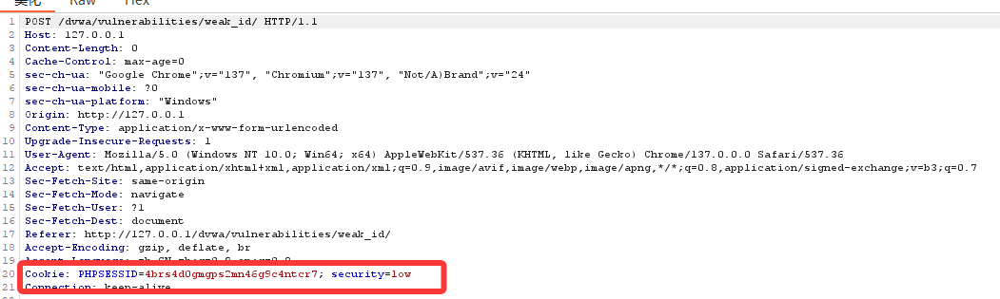
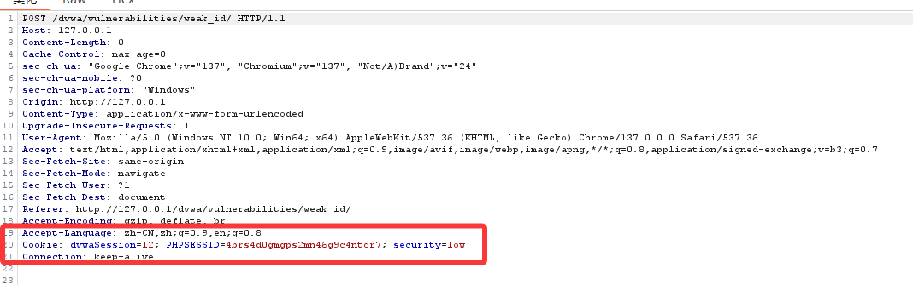
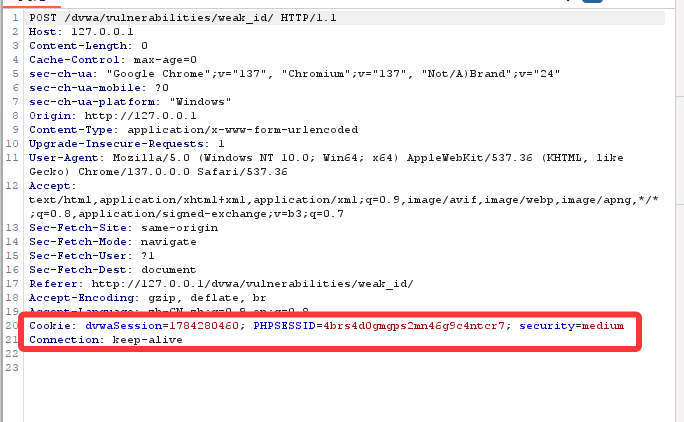
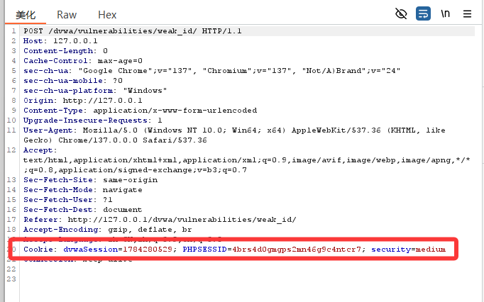
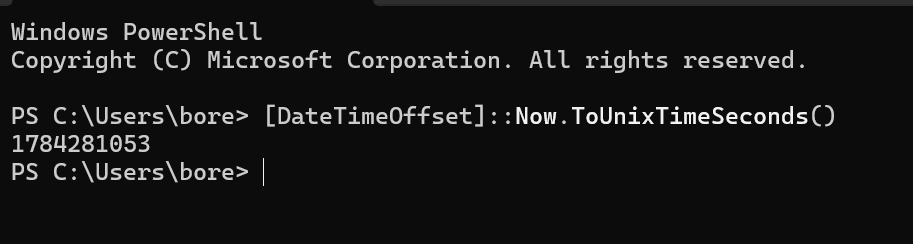
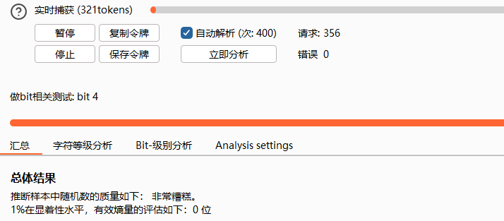
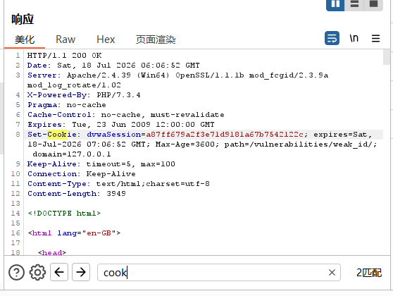
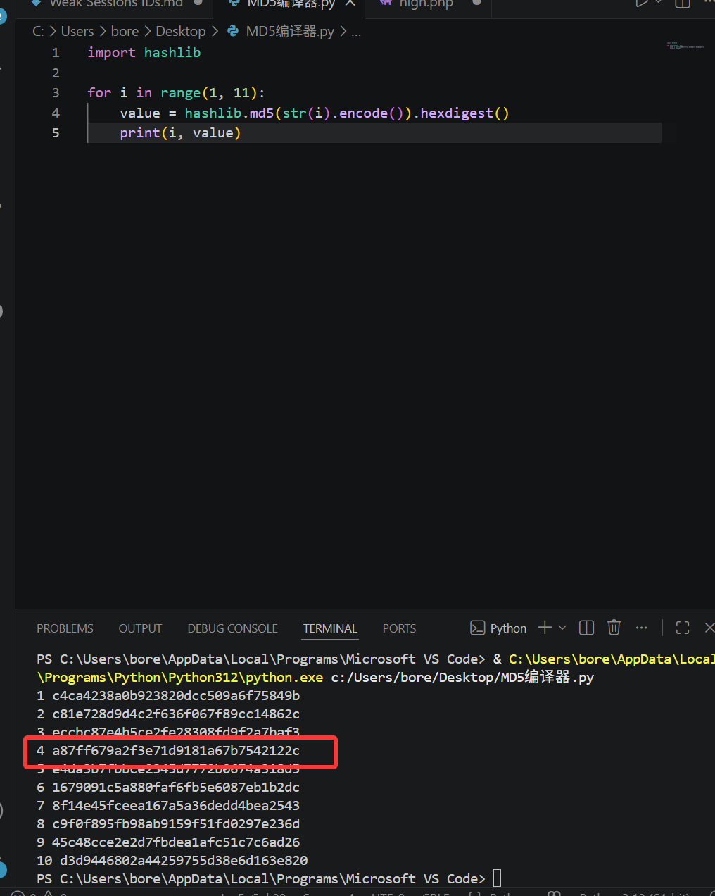
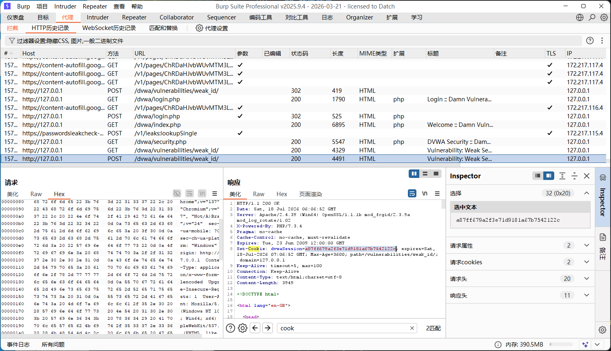

# Weak Sessions IDs弱会话
### 模块目标
```html
DVWA 的 Weak Session IDs 模块用于演示：如果 Web 应用生成 Session ID / Cookie 的方式不安全，攻击者可以通过观察、预测或枚举 Session ID，从而推测其他用户的会话标识。

该模块中，每次点击页面按钮时，服务端都会设置一个名为 dvwaSession 的 Cookie。
```
## 观察方法
**使用浏览器开发者工具**
1. 打开DVWA的Wrak Session IDs画面
2. 按F12打开开发者工具
3. 进入
>Application / Storage -> Cookies
4. 找到当前站点下的cookie
5. 点击页面中的Generate
**使用Burp Suite抓包**
1. 浏览器配置代理到burp Suite
2. 打开Burp Suite:Proxy -> HTTP history
3. 点击Weak Session IDs页面中的按钮
4. 找到返回包中的：Set-Cookie: dvwaSession=xxxx
5. 多点击几次，记录多个dvwaSession值
6. 你会看到cookie值类似：
```html
dvwaSession=1
dvwaSession=2
dvwaSession=3
dvwaSession=4
dvwaSession=5
```



## 漏洞原理
1. low级别使用的是递增函数作为session ID
2. 也就是说，每次生成cookie，服务端只是简单的吧某个计数器加1.
示意逻辑类似：
```html
$_SESSION['last_session_id']++;
$cookie_value = $_SESSION['last_session_id'];
setcookie("dvwaSession", $cookie_value);
```
## 攻击思路
如果攻击者看到自己的dvwasession是10,那么可以猜测其他用户的值可能是:8.9.11.12,这里session ID完全可预测
## 可学习知识点
1. Session ID 不应使用简单数字。
2. 自增 ID 可以被枚举。
3. 攻击者只需要观察少量样本，就能推测后续值。
4. Session ID 应该具备高随机性和不可预测性。

# Medium级别实操
## 现象观察
设置为medium难度后，连续点击按钮后，你可能看到类似：
```javascript
dvwaSession=1719301234
dvwaSession=1719301235
dvwaSession=1719301236
```
比如


乍看不像是简单递增ID，但是实际上他可能是Unix时间戳

## 漏洞原理
示意代码
```html
$cookie_value = time();
setcookie("dvwaSession", $cookie_value);
```
**time() 返回的是从 1970-01-01 00:00:00 UTC 到当前时间经过的秒数。**
例如：1719301234，表示某一具体时间点
### 为什么不安全
虽然时间戳看起来比1.2.3复杂，但它依然非常容易预测，因为攻击者大致知道请求发生的时间，不如：2025-06-21 14:30:00，那么session ID很可能就在这个时间点前后几秒钟内，攻击者只需要枚举一个小范围:
```html
1719301220
1719301221
1719301222
...
1719301240
```
即可覆盖可能的session ID
## 手工验证
1. 设置安全等级为medium
2. 进入该模块
3. 点击生成按钮
4. 记录cookie:dvwaSession=1719301234
5. 打开本地终端，查看当前unix时间戳
Linux系统/MacOS系统：
>date +%s
Windows PowerShell:
>[DateTimeOffset]::Now.ToUnixTimeSeconds()

对比cookie值和当前时间戳，如果数值接近，就说明它是基于时间生成的

## Burp Sequencer分析
>Burp Suite 的 Sequencer 可以用于分析 Token 或 Session ID 的随机性。参考资料中也提到可以通过 Burp Sequencer 对生成的 dvwaSession 做统计分析。
**步骤**
1. 打开Burp Suite
2. 访问Weak Session IDs页面
3. 点击按钮，抓到请求
4. 将请求发送到：Sequencer
5. 进入Sequencer -> Live capture
6. 配置提取响应中的Cookie:dvwaSession
7. 启动采集
8. 采集多个样本后观察结果
9. 你会发现这些值不是随机分布，而是和时间高度相关


>显示熵的质量为0是正常现象，time()返回当前的Unix时间戳，单位是秒，他不是随机数，他是当前时间，所以Burp Sequencer会判断它的随机性非常差，，因为它的值是可预测的，并且重复率高，大部分数字长期不变，看起来没有明显规律，并且无法预测。这个结果正是这个靶场想让你观察到的
| 难度       | 生成方式               | 问题                     |
|------------|------------------------|--------------------------|
| Low        | 递增数字               | 极易预测                 |
| Medium     | 当前时间戳             | 仍然可预测               |
| High       | 对计数值做 MD5         | 看起来复杂，但本质仍可预测 |
| Impossible | 加强 Cookie 属性和生成方式 | 相对更安全               |
```html
所以Medium的核心问题是：它把“当前时间”当成了 Session ID，这不是安全随机数。
简单一句话总结： DVWA weak session ids 的 medium 难度使用 time() 作为 dvwaSession，本质是时间戳，不是随机数，所以 Burp Sequencer
  ▎ 会检测出强规律性、低熵、重复和可预测性，因此显示随机数质量非常糟糕
```
你需要了解到：
1. 时间戳不是安全随机数。
2. 基于时间的 Session ID 可被暴力枚举。
3. 攻击者只需知道大致时间窗口即可缩小搜索范围。
4. 随机性和不可预测性不是一回事。
5. 看起来复杂的数字不一定安全。

# High级别实操
### 现象观察
**当你进入weak session ids页面后，连续点击按钮**
你可能会看到类似
```html
c4ca4238a0b923820dcc509a6f75849b
c81e728d9d4c2f636f067f89cc14862c
eccbc87e4b5ce2fe28308fd9f2a7baf3
a87ff679a2f3e71d9181a67b7542122c
```
这些值看起来像随机字符串，但实际上它们是 MD5 哈希值，也就是说
```html
md5(1) = c4ca4238a0b923820dcc509a6f75849b
md5(2) = c81e728d9d4c2f636f067f89cc14862c
md5(3) = eccbc87e4b5ce2fe28308fd9f2a7baf3
md5(4) = a87ff679a2f3e71d9181a67b7542122c
```

## 为什么High仍然不安全
**但是：MD5的输入是可预测的递增数字**，虽然输出看起来随机，但是本质上仍然是
>md5(1), md5(2), md5(3), md5(4)...
所以攻击者可以提前生成一个字典
```html
1 -> c4ca4238a0b923820dcc509a6f75849b
2 -> c81e728d9d4c2f636f067f89cc14862c
3 -> eccbc87e4b5ce2fe28308fd9f2a7baf3
```
然后根据观察到的 Cookie 反推出它对应的序号。

## 手工验证
进入high难度的该模块，记录第一个cookie
>c4ca4238a0b923820dcc509a6f75849b
如下是使用burp找到的cookie

建议使用Python编译器

获取cookie页面展示


## burp实操
1. 点击按钮生成多个cookie
2. 在Burp HTTP history中记录响应头
>Set-Cookie: dvwaSession=c4ca4238a0b923820dcc509a6f75849b
3. 继续点击，收集多个值
```html
c4ca4238a0b923820dcc509a6f75849b
c81e728d9d4c2f636f067f89cc14862c
eccbc87e4b5ce2fe28308fd9f2a7baf3
```
4. 使用Python生成md5(1) 到 md5(100)
5. 对比发现它们是连续整数的 MD5。

## 可学习的知识点
1. 哈希不等于随机。
2. MD5 已不适合安全场景。
3. 如果哈希输入可预测，输出也可以被预测。
4. “看起来随机”不代表“密码学安全”。
5. 安全 Token 应使用 CSPRNG，即密码学安全随机数生成器。
6. 对自增 ID 做 MD5、SHA1、Base64 都不能从根本上解决可预测问题。

# Impossible级别实操
## 现象观察
1. 进入Weak Session IDs页面，点击生成按钮
2. 你会发现dvwasession不再呈现简单规律
3. 参考资料中说明，impossible级别使用的是密码学安全随机Session ID

## 安全改进思路
1. 使用强随机数。
2. 避免自增。
3. 避免时间戳。
4. 避免可预测输入。
5. Cookie 设置更加安全。
可能的安全实现方式类似：
```html
$cookie_value = bin2hex(random_bytes(32));
setcookie("dvwaSession", $cookie_value, [
    'expires' => time() + 3600,
    'path' => '/vulnerabilities/weak_id/',
    'secure' => true,
    'httponly' => true,
    'samesite' => 'Strict'
]);
```
## 安全cookie属性
安全session cookie通常应该设置
```html
HttpOnly
Secure
SameSite
Path
Expires / Max-Age
```
1. HttpOnly
防止 JavaScript 读取 Cookie，降低 XSS 窃取 Cookie 的风险。

2. Secure
只允许 Cookie 通过 HTTPS 传输，防止明文网络中被窃听。

3. SameSite
减少 CSRF 攻击风险

4. Path
限制 Cookie 的作用路径。

5. Expires / Max-Age
控制 Cookie 生命周期。

## 可学习的知识点：
1. 安全 Session ID 应该来自密码学安全随机源。
2. 不能用自增数字、时间戳、用户名、IP、User-Agent 等作为核心生成依据。
3. Cookie 安全属性对会话保护非常重要。
4. Session ID 的安全性取决于：
```javascript
随机性
长度
不可预测性
生命周期
传输安全
服务端校验机制
```
# 四个级别对比总结
| 安全级别 | 生成方式 | 示例 | 是否可预测 | 问题 |
|---|---|---|---|---|
| Low | 自增整数 | `1`, `2`, `3` | 是 | 可直接枚举 |
| Medium | Unix 时间戳 | `1719301234` | 是 | 可根据时间窗口猜测 |
| High | `md5(自增整数)` | `c4ca4238...` | 是 | 哈希输入可预测 |
| Impossible | 安全随机数 | 随机 Token | 否 | 正确实现 |