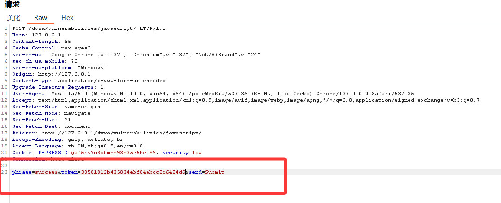
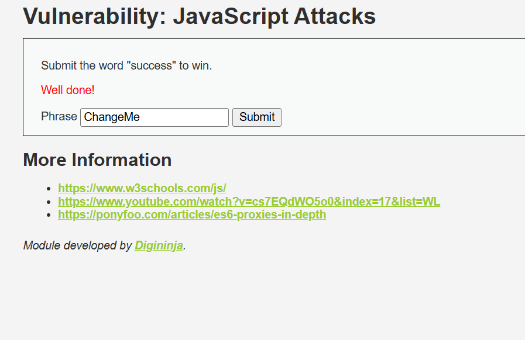

# javascript attacks
# 主要学习的内容：
1. 前端 JavaScript 逻辑分析
2. 隐藏字段 token 的生成方式
3. 浏览器开发者工具使用
4. 客户端校验绕过
5. 哈希、编码、字符串反转等基础
6. 为什么安全逻辑不能只放在前端
7. 服务端校验与客户端校验的区别
**目的：DVWA 的这个模块会在不同安全等级下，通过不同的 JavaScript 方式生成 token，你需要分析 token 生成逻辑，然后构造正确的 phrase 和 token 提交。**

# LOW级别实操
## 页面现象
1. 进入 Low 级别后，页面通常有一个输入框，默认值可能类似：
>ChangeMe
2. 目标是提交：
>success
3. 同时还需要提交一个正确的 token。
**根据公开资料，LOW级别中token的生成逻辑是：**
>token = md5(rot13(phrase))
4. 也就是说，先对Phrase做ROT13,再对结果做MD5

## 分析Javascript
1. 打开浏览器开发者工具
>F12 -> Sources
2. 查看页面中的javascript，可能会看到类似逻辑
```html
function rot13(inp) {
    return inp.replace(/[a-zA-Z]/g, function(c) {
        return String.fromCharCode(
            (c <= "Z" ? 90 : 122) >= 
            (c = c.charCodeAt(0) + 13) ? c : c - 26
        );
    });
}

function generate_token() {
    document.getElementById("token").value = md5(rot13(document.getElementById("phrase").value));
}
```
核心就是
>md5(rot13(phrase))
## 计算token 
目标phrase:
>success
先ROT13:
>success -> fhpprff
再MD5:
```HTML
md5("fhpprff") = 38581812b435834ebf84ebcc2c6424d6
```
### 方法一：直接改页面参数
1. 打开控制台：F12 -> Console
2. 输入：
```html
document.querySelector('[name="phrase"]').value = 'success';
document.querySelector('[name="token"]').value = '38581812b435834ebf84ebcc2c6424d6';
```
3. 然后点击提交按钮
4. 如果表单元素名称不同，可以现在Element里面确认input的name或者id
### 方法二：抓包修改
1. 使用Burp suite抓包，提交时修改Post数据为：
>phrase=success&token=38581812b435834ebf84ebcc2c6424d6
2. 提交后即可通过Low级别



# 学习点：
1. ROT13 编码
2. MD5 哈希
3. 前端隐藏字段不可信
4. JavaScript 逻辑可以被查看和修改
5. 客户端生成的 token 可以被逆向
6. 只靠前端校验没有安全性

# Medium级别实操
## 页面现象：
1. Medium级别仍然需要提交：phrase=success
2. 但是token的生成方式变了
3. 根据网络资料,Medium级别token的形式是：token = "XX" + reverse(phrase) + "XX"
4. 例如默认phrase= ChangeMe时，token是：
>XXeMegnahCXX
这说明它是对ChangeMe反转后，再前后拼接XX
## 分析token逻辑
1. 目标:phrase=success
2. 先字符串反转：success -> sseccus
3. 前后加上XX:XXsseccusXX
4. 所以最终：
```html
phrase=success
token=XXsseccusXX
```
5. 根据网络资料给出的 Medium 级别的结果：token=XXsseccusXX&phrase=success
## 方法一：控制台修改
1. 打开console:
```html
document.querySelector('[name="phrase"]').value = 'success';
document.querySelector('[name="token"]').value = 'XXsseccusXX';
```
2. 然后点击提交

## 方法二：自己写Javascript生成
```javascript
let phrase = 'success';
let reversed = phrase.split('').reverse().join('');
let token = 'XX' + reversed + 'XX';

console.log(token);
```
输出：
>XXsseccusXX
再填入页面：
document.querySelector('[name="phrase"]').value = phrase;
document.querySelector('[name="token"]').value = token;

## 方法三：Burp修改请求
将请求体改为：
>phrase=success&token=XXsseccusXX
提交即可通过
# Medium级别学习点：
1. 字符串反转逻辑
2. 简单 token 生成规则分析
3. 前端代码混淆并不等于安全
4. 隐藏字段可以被任意修改
5. 攻击者可以通过观察输入和输出推断算法
6. Burp 抓包修改参数的基本思路

# High级别实操

## 特点分析
1. 对 phrase 进行反转；
2. 在前面拼接 XX；
3. 进行 SHA256 等哈希处理
实际DVWA版本中常见逻辑可以理解为：
>token = sha256("XX" + reverse(phrase) + "XX")
也就是：
```html
phrase = success
reverse(phrase) = sseccus
拼接后 = XXsseccusXX
token = sha256("XXsseccusXX")
```
## 推荐分析方法
1. 进入HIgh页面后，打开
>F12 ->Sources
查找当前页面加载的Javascript文件，重点看：
1. 表单提交前调用了什么函数
2. token 字段如何被赋值
3. 是否有 sha256
4. 是否有字符串反转
5. 是否有 XX
6. 是否有类似 do_something() 的函数

也可以在Console里面尝试查看页面已有函数：
>console.log(window);
或者直接搜索：
>Ctrl + Shift + F
搜索关键词：
```html
token
sha256
XX
phrase
```

## 方法：使用cyberchef
1. 输入success
2. 使用操作:Reverse
3. 得到：sseccus
4. 手动拼接：XXsseccusXX
5. 在使用:SHA2 -> SHA-256

# High级别学习点
1. JavaScript 函数调用链分析
2. 外部 JS 文件分析
3. 代码混淆还原
4. SHA256 哈希使用
5. 浏览器 Console 调试
6. crypto.subtle.digest() 的使用
7. 断点调试
8. token 生成逻辑逆向
9. 为什么把安全算法放在前端不安全

# Impossible级别实操
这个级别的重点不是让你绕过，而是让你理解：
**真正的安全逻辑应该在服务端完成，不能依赖客户端 JavaScript。**

## 为什么 Impossible 级别不能像前面一样绕？
因为 Low、Medium、High 的问题在于：

token 生成逻辑暴露在客户端
攻击者可以：

1. 查看 JavaScript
2. 修改隐藏字段
3. 调用页面函数
4. 自己计算 token
5. 抓包重放或篡改
>而 Impossible 级别更合理的设计应该是：

1. token 由服务端生成
2. token 与用户会话绑定
3. token 不可预测
4. 服务端验证 token
5. 前端只负责展示，不负责安全决策
## Impossible 级别学习点
你可以学到：

1. 安全逻辑应放在服务端
2. 客户端输入完全不可信
3. CSRF token 思想
4. token 应该具备随机性和会话绑定
5. 不应把密钥、算法、验证规则暴露在前端
6. 服务端验证才是安全边界

# 四个等级总结表
| 安全等级 | token 逻辑 | 构造方式 | 示例 |
|---|---|---|---|
| Low | `md5(rot13(phrase))` | `success -> fhpprff -> md5` | `38581812b435834ebf84ebcc2c6424d6` |
| Medium | `"XX" + reverse(phrase) + "XX"` | `success -> sseccus -> XXsseccusXX` | `XXsseccusXX` |
| High | 通常为反转、拼接、SHA256 | `success -> sseccus -> XXsseccusXX -> sha256` | `sha256("XXsseccusXX")` |
| Impossible | 服务端安全校验 | 正常提交合法 phrase/token | 不应被客户端绕过 |